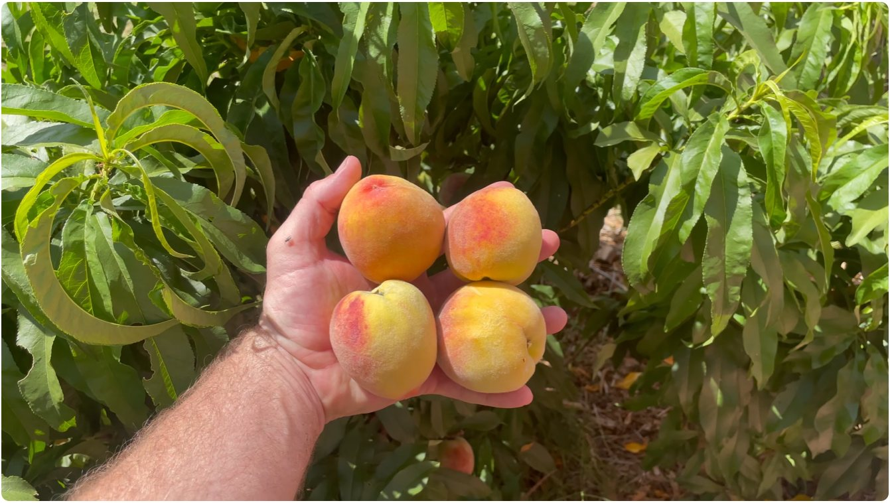
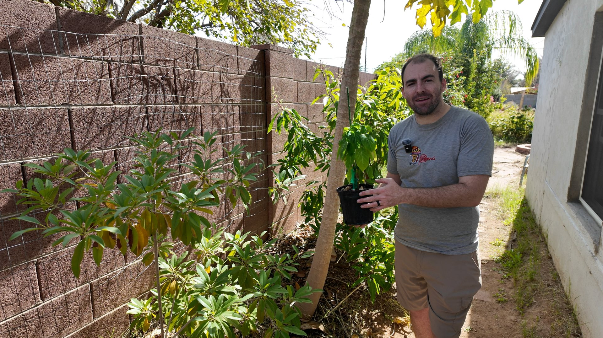
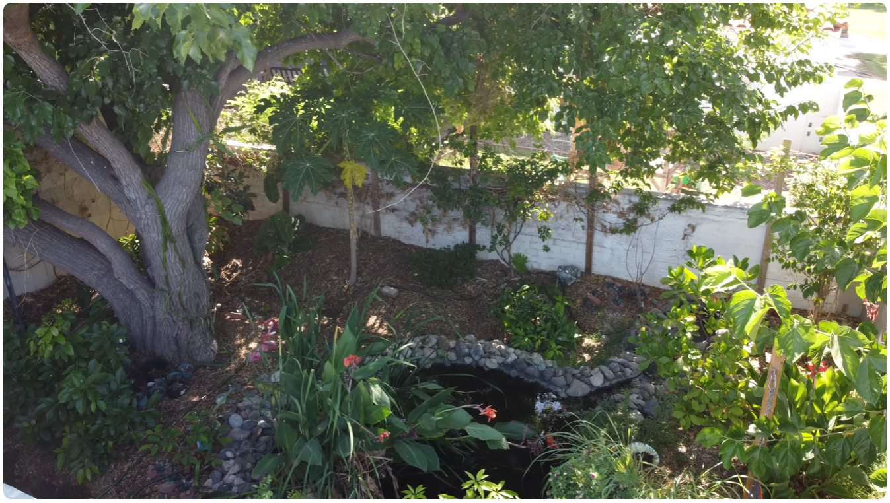
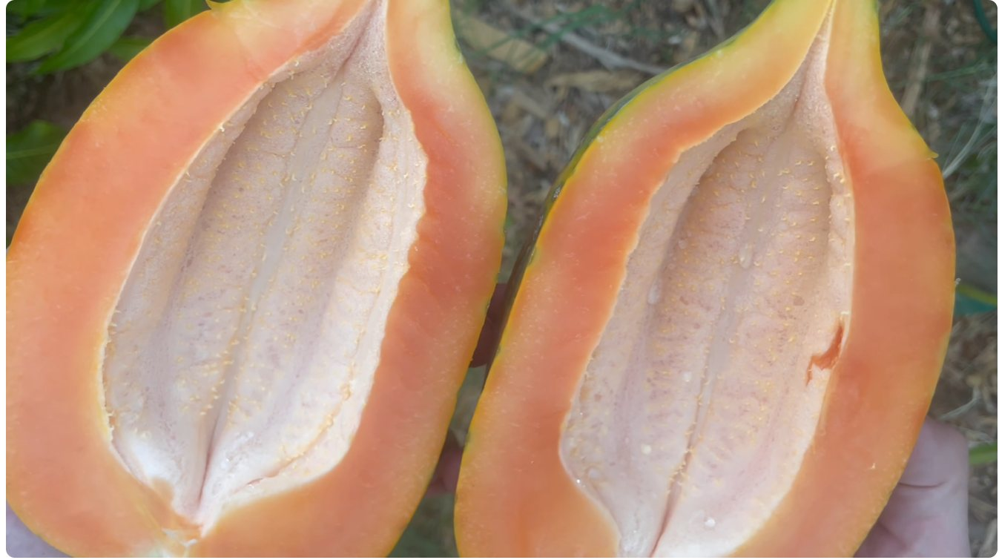
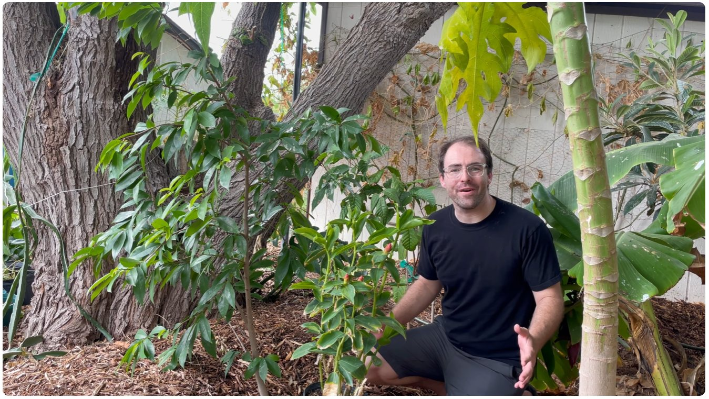
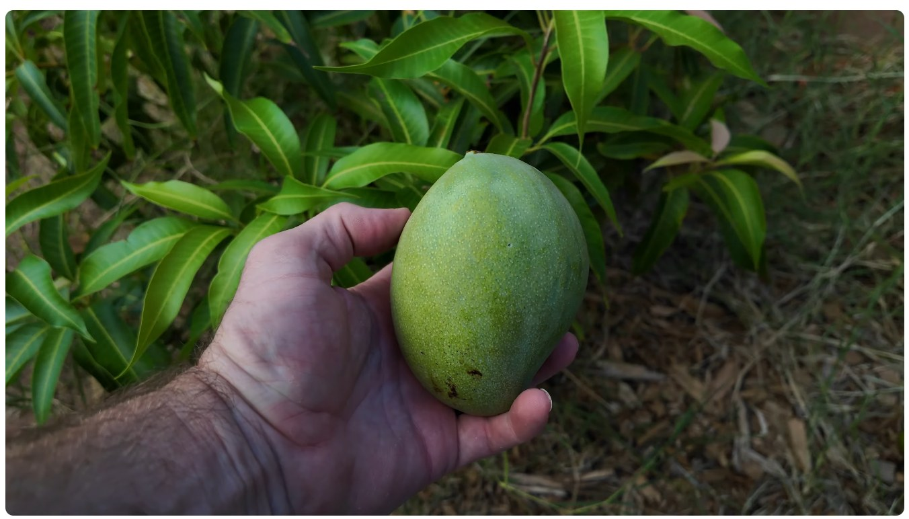
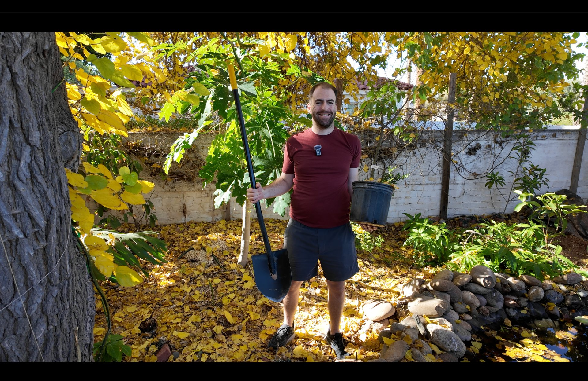
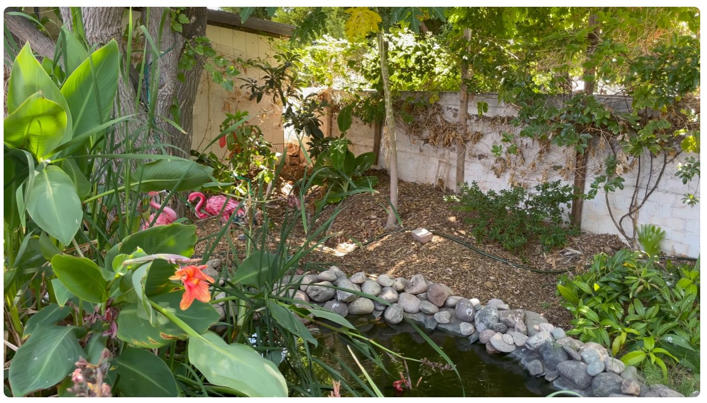
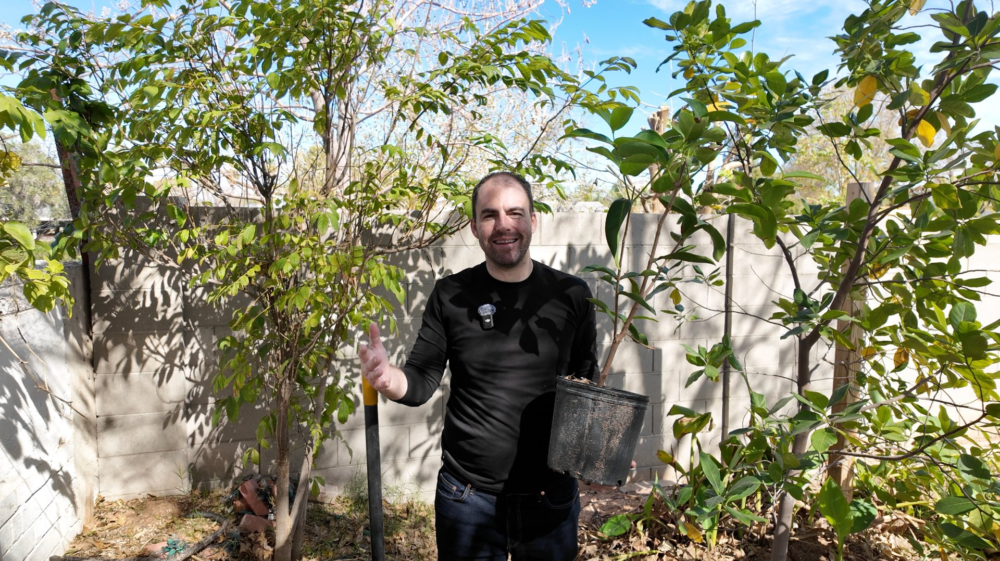

```{=html}
<style>
  /* =========================================================
     GROW IN PHOENIX LANDING PAGE
     ========================================================= */

  body:has(#gy-grow-hero) {
    overflow-x: hidden !important;
    background: #f8f6f0;
  }

  body:has(#gy-grow-hero) #title-block-header,
  body:has(#gy-grow-hero) .quarto-title-block {
    display: none !important;
  }

  body:has(#gy-grow-hero) #quarto-content,
  body:has(#gy-grow-hero) main.content,
  body:has(#gy-grow-hero) .page-columns,
  body:has(#gy-grow-hero) .content,
  body:has(#gy-grow-hero) .content-block {
    width: 100% !important;
    max-width: none !important;
    margin: 0 !important;
    padding: 0 !important;
  }

  body:has(#gy-grow-hero) main.content {
    padding-top: 0 !important;
    margin-top: 0 !important;
  }

  body:has(#gy-grow-hero) #quarto-content.page-columns,
  body:has(#gy-grow-hero) main.content.page-columns {
    display: block !important;
    grid-template-columns: none !important;
  }

  body:has(#gy-grow-hero) #quarto-content > *,
  body:has(#gy-grow-hero) main.content > * {
    grid-column: auto !important;
  }


  /* =========================================================
     FULL-WIDTH ROTATING HERO
     ========================================================= */

  #gy-grow-hero {
    position: relative;

    width: 100vw !important;
    max-width: none !important;

    left: 50% !important;
    margin-left: -50vw !important;
    margin-right: 0 !important;
    margin-top: 10px;

    min-height: 620px;

    overflow: hidden;
    display: flex;
    align-items: center;
    isolation: isolate;

    background: #082f24;
  }

  #gy-grow-hero .gy-grow-slideshow {
    position: absolute;
    inset: 0;
    z-index: 0;

    width: 100%;
    height: 100%;
    overflow: hidden;

    background: #082f24;
  }

  #gy-grow-hero .gy-grow-slide {
    position: absolute;
    inset: 0;

    display: block;
    width: 100%;
    height: 100%;
    max-width: none;

    margin: 0;
    padding: 0;
    border: 0;

    object-fit: cover;
    object-position: center;

    opacity: 0;

    transition: opacity 1.5s ease-in-out;

    pointer-events: none;
  }

  #gy-grow-hero .gy-grow-slide.is-active {
    opacity: 1;
  }

  #gy-grow-hero .gy-grow-overlay {
    position: absolute;
    inset: 0;
    z-index: 1;

    background:
      linear-gradient(
        90deg,
        rgba(3, 29, 22, 0.97) 0%,
        rgba(3, 29, 22, 0.88) 34%,
        rgba(3, 29, 22, 0.55) 62%,
        rgba(3, 29, 22, 0.24) 100%
      );

    pointer-events: none;
  }

  #gy-grow-hero .gy-grow-content {
    position: relative;
    z-index: 2;

    width: min(790px, 90%);
    margin-left: max(5vw, 45px);
    padding: 75px 0;

    color: #ffffff;
  }

  .gy-grow-kicker {
    display: block;
    margin: 0 0 17px;

    color: #d6ed91;
    font-family: Arial, Helvetica, sans-serif;
    font-size: 12px;
    font-weight: 800;
    line-height: 1.2;
    letter-spacing: 0.15em;
    text-transform: uppercase;

    text-shadow: 0 2px 8px rgba(0, 0, 0, 0.36);
  }

  #gy-grow-hero h1 {
    max-width: 790px;
    margin: 0 0 24px !important;

    color: #ffffff;
    font-family: Georgia, "Times New Roman", serif;
    font-size: clamp(43px, 4.6vw, 72px) !important;
    font-weight: 600 !important;
    line-height: 1.04 !important;
    letter-spacing: -0.025em !important;
    text-transform: none !important;

    text-shadow: 0 3px 13px rgba(0, 0, 0, 0.46);
  }

  #gy-grow-hero p {
    max-width: 690px;
    margin: 0 0 32px;

    color: rgba(255, 255, 255, 0.96);
    font-family: Arial, Helvetica, sans-serif;
    font-size: 19px;
    line-height: 1.65;

    text-shadow: 0 2px 8px rgba(0, 0, 0, 0.38);
  }

  .gy-grow-actions {
    display: flex;
    flex-wrap: wrap;
    gap: 12px;
  }

  .gy-grow-button {
    display: inline-flex;
    align-items: center;
    justify-content: center;

    min-height: 54px;
    padding: 14px 25px;

    color: #ffffff !important;
    background: #256844;
    border: 1px solid #256844;
    border-radius: 5px;

    font-family: Arial, Helvetica, sans-serif;
    font-size: 13px;
    font-weight: 800;
    line-height: 1;
    letter-spacing: 0.045em;
    text-decoration: none !important;
    text-transform: uppercase;

    transition:
      transform 0.2s ease,
      background-color 0.2s ease;
  }

  .gy-grow-button:hover {
    color: #ffffff !important;
    background: #317b53;
    transform: translateY(-2px);
  }

  .gy-grow-button.secondary {
    background: transparent;
    border-color: rgba(255, 255, 255, 0.88);
  }

  .gy-grow-button.secondary:hover {
    background: rgba(255, 255, 255, 0.10);
  }


  /* =========================================================
     MAIN PAGE CONTENT
     ========================================================= */

  .gy-grow-main {
    position: relative;

    width: 100vw !important;
    max-width: none !important;

    left: 50% !important;
    margin-left: -50vw !important;
    margin-right: 0 !important;

    padding: 76px clamp(28px, 5vw, 90px) 28px;
    box-sizing: border-box;

    background: #f8f6f0;
  }

  .gy-grow-inner {
    width: 100%;
    max-width: 1640px;
    margin: 0 auto;
  }

  .gy-section-heading {
    max-width: 850px;
    margin: 0 0 33px;
  }

  .gy-section-label {
    display: block;
    margin: 0 0 10px;

    color: #597548;
    font-family: Arial, Helvetica, sans-serif;
    font-size: 12px;
    font-weight: 800;
    line-height: 1.2;
    letter-spacing: 0.14em;
    text-transform: uppercase;
  }

  .gy-section-heading h2 {
    margin: 0 0 15px !important;

    color: #17382c;
    font-family: Georgia, "Times New Roman", serif;
    font-size: clamp(34px, 3.5vw, 52px) !important;
    font-weight: 600 !important;
    line-height: 1.1 !important;
    letter-spacing: -0.02em !important;
    text-transform: none !important;
  }

  .gy-section-heading p {
    max-width: 790px;
    margin: 0;

    color: #52615b;
    font-family: Arial, Helvetica, sans-serif;
    font-size: 17px;
    line-height: 1.7;
  }


  /* =========================================================
     PLANT JOURNEYS
     ========================================================= */

  .gy-journey-section {
    margin: 0 0 82px;
  }

  .gy-journey-grid {
    display: grid;
    grid-template-columns: repeat(3, minmax(0, 1fr));
    gap: 20px;
  }

  .gy-journey-card {
    position: relative;
    min-height: 245px;

    padding: 28px;

    border: 1px solid rgba(7, 56, 44, 0.13);
    border-radius: 9px;

    background: #ffffff;
    box-shadow: 0 8px 24px rgba(18, 47, 36, 0.08);

    overflow: hidden;

    transition:
      transform 0.2s ease,
      box-shadow 0.2s ease;
  }

  .gy-journey-card:hover {
    transform: translateY(-4px);
    box-shadow: 0 14px 31px rgba(18, 47, 36, 0.14);
  }

  .gy-journey-tag {
    display: inline-block;
    margin: 0 0 15px;
    padding: 7px 10px;

    border-radius: 999px;

    background: #edf3dc;
    color: #52733e;

    font-family: Arial, Helvetica, sans-serif;
    font-size: 10px;
    font-weight: 800;
    line-height: 1;
    letter-spacing: 0.08em;
    text-transform: uppercase;
  }

  .gy-journey-card h3 {
    margin: 0 0 12px !important;

    color: #17382c;
    font-family: Georgia, "Times New Roman", serif;
    font-size: 27px !important;
    font-weight: 600 !important;
    line-height: 1.13 !important;
    text-transform: none !important;
  }

  .gy-journey-card p {
    margin: 0 0 19px;

    color: #56675f;
    font-family: Arial, Helvetica, sans-serif;
    font-size: 14px;
    line-height: 1.7;
  }

  .gy-journey-link {
    display: inline-block;

    color: #0d4b38;
    font-family: Arial, Helvetica, sans-serif;
    font-size: 11px;
    font-weight: 800;
    line-height: 1.2;
    letter-spacing: 0.055em;
    text-transform: uppercase;
  }


  /* =========================================================
     UNDERSTANDING PHOENIX
     ========================================================= */

  .gy-learn-wrap {
    position: relative;

    width: 100vw !important;
    max-width: none !important;

    left: 50% !important;
    margin-left: -50vw !important;
    margin-right: 0 !important;

    padding: 82px clamp(28px, 5vw, 90px);
    box-sizing: border-box;

    background: #ffffff;
  }

  .gy-learn-inner {
    width: 100%;
    max-width: 1640px;
    margin: 0 auto;
  }

  .gy-learn-grid {
    display: grid;
    grid-template-columns: repeat(3, minmax(0, 1fr));
    gap: 18px;
  }

  .gy-learn-card {
    min-height: 205px;
    padding: 28px;

    border: 1px solid rgba(7, 56, 44, 0.11);
    border-radius: 9px;

    background: #f4f1e9;

    transition:
      transform 0.2s ease,
      box-shadow 0.2s ease;
  }

  .gy-learn-card:hover {
    transform: translateY(-3px);
    box-shadow: 0 11px 28px rgba(18, 47, 36, 0.08);
  }

  .gy-learn-card h3 {
    margin: 0 0 12px !important;

    color: #17382c;
    font-family: Georgia, "Times New Roman", serif;
    font-size: 25px !important;
    font-weight: 600 !important;
    line-height: 1.15 !important;
    text-transform: none !important;
  }

  .gy-learn-card p {
    margin: 0 0 18px;

    color: #596861;
    font-family: Arial, Helvetica, sans-serif;
    font-size: 14px;
    line-height: 1.65;
  }

  .gy-learn-link {
    color: #0d4b38;
    font-family: Arial, Helvetica, sans-serif;
    font-size: 11px;
    font-weight: 800;
    letter-spacing: 0.055em;
    text-transform: uppercase;
  }


  /* =========================================================
     STORY / PROOF OF WORK
     ========================================================= */

  .gy-story-wrap {
    position: relative;

    width: 100vw !important;
    max-width: none !important;

    left: 50% !important;
    margin-left: -50vw !important;
    margin-right: 0 !important;

    padding: 88px clamp(28px, 5vw, 90px);
    box-sizing: border-box;

    background: #f8f6f0;
  }

  .gy-story {
    width: 100%;
    max-width: 1640px;
    margin: 0 auto;

    display: grid;
    grid-template-columns: minmax(0, 0.92fr) minmax(0, 1.08fr);
    gap: clamp(38px, 5vw, 76px);
    align-items: center;
  }

  .gy-story-image {
    overflow: hidden;
    border-radius: 9px;

    box-shadow: 0 12px 32px rgba(18, 47, 36, 0.12);
  }

  .gy-story-image img {
    display: block;
    width: 100%;
    aspect-ratio: 16 / 10;
    object-fit: cover;
  }

  .gy-story-copy .gy-section-label {
    margin-bottom: 11px;
  }

  .gy-story-copy h2 {
    margin: 0 0 19px !important;

    color: #17382c;
    font-family: Georgia, "Times New Roman", serif;
    font-size: clamp(35px, 3.7vw, 54px) !important;
    font-weight: 600 !important;
    line-height: 1.08 !important;
    letter-spacing: -0.025em !important;
    text-transform: none !important;
  }

  .gy-story-copy p {
    max-width: 760px;
    margin: 0 0 16px;

    color: #52615b;
    font-family: Arial, Helvetica, sans-serif;
    font-size: 16px;
    line-height: 1.78;
  }


  /* =========================================================
     CLASSES / FUTURE PAID LEARNING
     ========================================================= */

  .gy-classes-wrap {
    position: relative;

    width: 100vw !important;
    max-width: none !important;

    left: 50% !important;
    margin-left: -50vw !important;
    margin-right: 0 !important;

    padding: 84px clamp(28px, 5vw, 90px);
    box-sizing: border-box;

    background: #123d2d;
  }

  .gy-classes-inner {
    width: 100%;
    max-width: 1640px;
    margin: 0 auto;

    display: grid;
    grid-template-columns: minmax(0, 1.25fr) minmax(320px, 0.75fr);
    gap: clamp(40px, 5vw, 78px);
    align-items: center;
  }

  .gy-classes-copy .gy-section-label {
    color: #d6ed91;
  }

  .gy-classes-copy h2 {
    margin: 0 0 18px !important;

    color: #ffffff;
    font-family: Georgia, "Times New Roman", serif;
    font-size: clamp(36px, 3.8vw, 56px) !important;
    font-weight: 600 !important;
    line-height: 1.08 !important;
    letter-spacing: -0.025em !important;
    text-transform: none !important;
  }

  .gy-classes-copy p {
    max-width: 780px;
    margin: 0;

    color: rgba(255, 255, 255, 0.9);
    font-family: Arial, Helvetica, sans-serif;
    font-size: 17px;
    line-height: 1.8;
  }

  .gy-classes-card {
    padding: 30px;

    border: 1px solid rgba(255, 255, 255, 0.18);
    border-radius: 9px;

    background: rgba(255, 255, 255, 0.07);
  }

  .gy-classes-card h3 {
    margin: 0 0 11px !important;

    color: #ffffff;
    font-family: Georgia, "Times New Roman", serif;
    font-size: 27px !important;
    font-weight: 600 !important;
    line-height: 1.15 !important;
    text-transform: none !important;
  }

  .gy-classes-card p {
    margin: 0 0 21px;

    color: rgba(255, 255, 255, 0.82);
    font-family: Arial, Helvetica, sans-serif;
    font-size: 14px;
    line-height: 1.7;
  }

  .gy-coming-soon {
    display: inline-block;

    padding: 10px 13px;

    border-radius: 999px;

    color: #17382c;
    background: #d6ed91;

    font-family: Arial, Helvetica, sans-serif;
    font-size: 10px;
    font-weight: 800;
    line-height: 1;
    letter-spacing: 0.075em;
    text-transform: uppercase;
  }


  /* =========================================================
     TABLET
     ========================================================= */

  @media (max-width: 1050px) {
    .gy-journey-grid,
    .gy-learn-grid {
      grid-template-columns: repeat(2, minmax(0, 1fr));
    }

    .gy-story,
    .gy-classes-inner {
      grid-template-columns: 1fr;
      gap: 30px;
    }
  }


  /* =========================================================
     MOBILE
     ========================================================= */

  @media (max-width: 700px) {
    #gy-grow-hero {
      min-height: 610px;
      align-items: flex-end;
    }

    #gy-grow-hero .gy-grow-overlay {
      background: rgba(3, 29, 22, 0.72);
    }

    #gy-grow-hero .gy-grow-content {
      width: 100%;
      margin: 0;
      padding: 50px 24px 45px;
      box-sizing: border-box;
    }

    #gy-grow-hero h1 {
      font-size: clamp(39px, 11vw, 52px) !important;
      line-height: 1.04 !important;
    }

    #gy-grow-hero p {
      max-width: 100%;
      font-size: 16px;
      line-height: 1.58;
    }

    .gy-grow-actions {
      display: grid;
      grid-template-columns: 1fr;
    }

    .gy-grow-button {
      width: 100%;
      box-sizing: border-box;
    }

    .gy-grow-main,
    .gy-learn-wrap,
    .gy-story-wrap,
    .gy-classes-wrap {
      width: 100vw !important;
      max-width: none !important;
      left: 50% !important;
      margin-left: -50vw !important;
      margin-right: 0 !important;
      box-sizing: border-box;
    }

    .gy-grow-main {
      padding: 58px 20px 28px;
    }

    .gy-learn-wrap,
    .gy-story-wrap,
    .gy-classes-wrap {
      padding: 62px 20px;
    }

    .gy-journey-grid,
    .gy-learn-grid {
      grid-template-columns: 1fr;
    }

    .gy-journey-card,
    .gy-learn-card {
      min-height: 0;
    }
  }


  /* =========================================================
     ACCESSIBILITY
     ========================================================= */

  @media (prefers-reduced-motion: reduce) {
    #gy-grow-hero .gy-grow-slide {
      transition: opacity 0.4s ease;
    }

    .gy-journey-card,
    .gy-learn-card,
    .gy-grow-button {
      transition: none;
    }
  }
</style>


<section id="gy-grow-hero">

  <div class="gy-grow-slideshow" aria-hidden="true">

 
     
    

    

    

    

  

    

    

  </div>


  <div class="gy-grow-overlay"></div>


  <div class="gy-grow-content">

    <span class="gy-grow-kicker">
      Grow in Phoenix
    </span>

    <h1>
      What Happens When You Grow the Unexpected in the Desert?
    </h1>

    <p>
      Follow years of growing tropical, subtropical, and traditional fruit
      trees in my Phoenix food forest—from planting and extreme summers to
      winter cold, flowering, harvests, setbacks, and everything learned
      along the way.
    </p>

    <div class="gy-grow-actions">

      <a class="gy-grow-button" href="#plant-journeys">
        Follow the Plant Journeys
      </a>

      <a class="gy-grow-button secondary" href="#understanding-phoenix">
        Explore Growing in Phoenix
      </a>

    </div>

  </div>

</section>


<main class="gy-grow-main">

  <div class="gy-grow-inner">

    <section id="plant-journeys" class="gy-journey-section">

      <div class="gy-section-heading">

        <span class="gy-section-label">
          Follow the Plant Journeys
        </span>

        <h2>
          See What Happens Over Time
        </h2>

        <p>
          These pages bring years of plant updates together in one place.
          Follow individual trees through planting, extreme heat, winter cold,
          flowering, fruiting, setbacks, recovery, and harvests as their
          stories continue to unfold in the Phoenix desert.
        </p>

      </div>


      <div class="gy-journey-grid">

        <article class="gy-journey-card">

          <span class="gy-journey-tag">
            Plant Journey
          </span>

          <h3>
            Mango
          </h3>

          <p>
            Follow mango trees through years of growth, seasonal change,
            flowering, fruit production, and the realities of growing them
            in Phoenix.
          </p>

          <span class="gy-journey-link">
            Journey page coming soon →
          </span>

        </article>


        <article class="gy-journey-card">

          <span class="gy-journey-tag">
            Plant Journey
          </span>

          <h3>
            Jackfruit
          </h3>

          <p>
            One of the food forest’s boldest experiments, documented through
            planting, growth, summer heat, winter conditions, setbacks, and
            recovery.
          </p>

          <span class="gy-journey-link">
            Journey page coming soon →
          </span>

        </article>


        <article class="gy-journey-card">

          <span class="gy-journey-tag">
            Plant Journey
          </span>

          <h3>
            Longan
          </h3>

          <p>
            Follow a young subtropical tree as it becomes part of the food
            forest and faces the unusual conditions of the Phoenix desert.
          </p>

          <span class="gy-journey-link">
            Journey page coming soon →
          </span>

        </article>


        <article class="gy-journey-card">

          <span class="gy-journey-tag">
            Plant Journey
          </span>

          <h3>
            Lychee
          </h3>

          <p>
            Track how lychee responds to Phoenix seasons, establishment,
            growth, and the changing microclimates around the food forest.
          </p>

          <span class="gy-journey-link">
            Journey page coming soon →
          </span>

        </article>


        <article class="gy-journey-card">

          <span class="gy-journey-tag">
            Plant Journey
          </span>

          <h3>
            Grumichama
          </h3>

          <p>
            Years of patient growth leading toward flowering, fruiting,
            and the possibility of a first Brazilian cherry harvest.
          </p>

          <span class="gy-journey-link">
            Journey page coming soon →
          </span>

        </article>


        <article class="gy-journey-card">

          <span class="gy-journey-tag">
            Plant Journey
          </span>

          <h3>
            Black Sapote
          </h3>

          <p>
            Follow repeated flowering seasons, Phoenix winter conditions,
            tree development, and the ongoing wait for fruit.
          </p>

          <span class="gy-journey-link">
            Journey page coming soon →
          </span>

        </article>

      </div>

    </section>

  </div>

</main>


<section id="understanding-phoenix" class="gy-learn-wrap">

  <div class="gy-learn-inner">

    <div class="gy-section-heading">

      <span class="gy-section-label">
        Understanding the Desert
      </span>

      <h2>
        Growing Food in Phoenix Is Different
      </h2>

      <p>
        Phoenix creates a growing environment unlike most traditional fruit
        growing regions. These pages explore the conditions shaping the
        plants in The Green Yard and the patterns that continue to appear
        across years of growing here.
      </p>

    </div>


    <div class="gy-learn-grid">

      <article class="gy-learn-card">

        <h3>
          Phoenix Climate
        </h3>

        <p>
          Explore the seasonal conditions that shape food growing in the
          low desert.
        </p>

        <span class="gy-learn-link">
          Coming soon →
        </span>

      </article>


      <article class="gy-learn-card">

        <h3>
          Summer Heat
        </h3>

        <p>
          See how extreme summer conditions show up across years of growing
          fruit trees in Phoenix.
        </p>

        <span class="gy-learn-link">
          Coming soon →
        </span>

      </article>


      <article class="gy-learn-card">

        <h3>
          Winter Cold
        </h3>

        <p>
          Phoenix winters are mild, but cold nights still shape what
          succeeds, what struggles, and how plants recover.
        </p>

        <span class="gy-learn-link">
          Coming soon →
        </span>

      </article>


      <article class="gy-learn-card">

        <h3>
          Water
        </h3>

        <p>
          Explore how desert conditions and water availability influence
          an edible landscape over time.
        </p>

        <span class="gy-learn-link">
          Coming soon →
        </span>

      </article>


      <article class="gy-learn-card">

        <h3>
          Microclimates
        </h3>

        <p>
          See how different parts of the same property can create noticeably
          different conditions for plants.
        </p>

        <span class="gy-learn-link">
          Coming soon →
        </span>

      </article>


      <article class="gy-learn-card">

        <h3>
          Building a Food Forest
        </h3>

        <p>
          Follow the evolution of The Green Yard as a desert landscape becomes
          denser, more established, and more productive.
        </p>

        <span class="gy-learn-link">
          Coming soon →
        </span>

      </article>

    </div>

  </div>

</section>


<section class="gy-story-wrap">

  <div class="gy-story">

    <div class="gy-story-image">

      

    </div>


    <div class="gy-story-copy">

      <span class="gy-section-label">
        The Green Yard
      </span>

      <h2>
        Years of Experiments, Documented in One Place
      </h2>

      <p>
        The Green Yard did not appear overnight. It has been built plant by
        plant and season by season, with successes, mistakes, surprises,
        losses, and changes along the way.
      </p>

      <p>
        This section brings that history together so individual plants can
        be followed across years instead of being reduced to one planting
        video or a single seasonal update.
      </p>

    </div>

  </div>

</section>


<section class="gy-classes-wrap">

  <div class="gy-classes-inner">

    <div class="gy-classes-copy">

      <span class="gy-section-label">
        Learn With The Green Yard
      </span>

      <h2>
        Want to Go Deeper?
      </h2>

      <p>
        I’m developing classes built around years of growing tropical,
        subtropical, and traditional fruit trees in the Phoenix desert.
        These classes will go beyond individual updates and bring those
        lessons together into a more complete learning experience.
      </p>

    </div>


    <div class="gy-classes-card">

      <h3>
        Phoenix Growing Classes
      </h3>

      <p>
        In-person and video-based learning options are being developed.
        More information will be added here as those programs take shape.
      </p>

      <span class="gy-coming-soon">
        Classes Coming Soon
      </span>

    </div>

  </div>

</section>


<script>
(function () {
  function startGrowSlideshow() {
    const slides = document.querySelectorAll(
      "#gy-grow-hero .gy-grow-slide"
    );

    if (slides.length < 2) {
      return;
    }

    let current = 0;

    window.setInterval(function () {
      slides[current].classList.remove("is-active");
      current = (current + 1) % slides.length;
      slides[current].classList.add("is-active");
    }, 6500);
  }

  if (document.readyState === "loading") {
    document.addEventListener(
      "DOMContentLoaded",
      startGrowSlideshow
    );
  } else {
    startGrowSlideshow();
  }
})();
</script>
```
