```{=html}
<style>
  /* =========================================================
     HOMEPAGE LAYOUT
     ========================================================= */

  body:has(#gy-home-hero) {
    overflow-x: hidden !important;
  }

  body:has(#gy-home-hero) #quarto-content,
  body:has(#gy-home-hero) main.content,
  body:has(#gy-home-hero) .page-columns,
  body:has(#gy-home-hero) .content,
  body:has(#gy-home-hero) .content-block {
    width: 100% !important;
    max-width: none !important;
    margin: 0 !important;
    padding: 0 !important;
  }

  body:has(#gy-home-hero) main.content {
    padding-top: 0 !important;
    margin-top: 0 !important;
  }


  /* =========================================================
     FULL-WIDTH HERO
     ========================================================= */

  #gy-home-hero {
    position: relative;

    width: 100vw !important;
    max-width: none !important;

    left: 50% !important;
    margin-left: -50vw !important;
    margin-right: 0 !important;

    min-height: 610px;

    overflow: hidden;
    display: flex;
    align-items: center;
    isolation: isolate;

    border: 0 !important;
    border-radius: 0 !important;
    background: #082f24;
  }

  #gy-home-hero .gy-slideshow {
    position: absolute;
    inset: 0;
    z-index: 0;

    width: 100%;
    height: 100%;
    overflow: hidden;
  }

  #gy-home-hero .gy-slide {
    position: absolute;
    inset: 0;

    width: 100%;
    height: 100%;
    max-width: none;

    margin: 0;
    padding: 0;
    border: 0;

    object-fit: cover;
    object-position: center;

    opacity: 0;
    transform: scale(1.02);

    transition: opacity 1.5s ease-in-out;
    animation: gyHeroZoom 12s ease-out infinite alternate;

    pointer-events: none;
  }

  #gy-home-hero .gy-slide.is-active {
    opacity: 1;
  }

  @keyframes gyHeroZoom {
    from {
      transform: scale(1.02);
    }

    to {
      transform: scale(1.08);
    }
  }

  #gy-home-hero .gy-overlay {
    position: absolute;
    inset: 0;
    z-index: 1;

    background:
      linear-gradient(
        90deg,
        rgba(3, 29, 22, 0.94) 0%,
        rgba(3, 29, 22, 0.80) 38%,
        rgba(3, 29, 22, 0.38) 68%,
        rgba(3, 29, 22, 0.12) 100%
      );

    pointer-events: none;
  }

  #gy-home-hero .gy-content {
    position: relative;
    z-index: 2;

    width: min(760px, 90%);
    margin-left: max(5vw, 45px);
    padding: 72px 0;

    color: #ffffff;
  }

  #gy-home-hero .gy-content::before {
    content: "What does abundance look like around the world?";

    display: block;
    max-width: 760px;
    margin: 0 0 24px;

    color: #ffffff;
    font-family: Georgia, "Times New Roman", serif;
    font-size: clamp(40px, 3.8vw, 58px);
    font-weight: 600;
    line-height: 1.08;
    letter-spacing: -0.02em;

    text-shadow: 0 2px 10px rgba(0, 0, 0, 0.42);
  }

  #gy-home-hero .gy-description {
    max-width: 650px;
    margin: 0 0 32px;

    color: rgba(255, 255, 255, 0.96);
    font-family: Arial, Helvetica, sans-serif;
    font-size: 20px;
    line-height: 1.6;

    text-shadow: 0 2px 8px rgba(0, 0, 0, 0.35);
  }

  #gy-home-hero .gy-buttons {
    display: flex;
    flex-wrap: wrap;
    gap: 14px;
  }

  #gy-home-hero .gy-button {
    display: inline-flex;
    align-items: center;
    justify-content: center;

    min-height: 54px;
    padding: 14px 24px;

    border-radius: 5px;

    font-family: Arial, Helvetica, sans-serif;
    font-size: 14px;
    font-weight: 700;
    letter-spacing: 0.035em;
    text-decoration: none;
    text-transform: uppercase;

    transition:
      transform 0.2s ease,
      background-color 0.2s ease;
  }

  #gy-home-hero .gy-button-primary {
    color: #ffffff;
    background: #256844;
    border: 1px solid #256844;
  }

  #gy-home-hero .gy-button-primary:hover {
    color: #ffffff;
    background: #317b53;
    transform: translateY(-2px);
  }

  #gy-home-hero .gy-button-secondary {
    color: #ffffff;
    background: rgba(4, 28, 21, 0.30);
    border: 1px solid rgba(255, 255, 255, 0.82);
  }

  #gy-home-hero .gy-button-secondary:hover {
    color: #ffffff;
    background: rgba(255, 255, 255, 0.15);
    transform: translateY(-2px);
  }


  /* =========================================================
     FEATURED TOUR + LOCATIONS
     ========================================================= */

  .gy-discover-section {
    width: 100%;
    padding: 78px 5vw 86px;
    box-sizing: border-box;

    background: #f7f5ef;
  }

  .gy-discover-grid {
    display: grid;
    grid-template-columns: minmax(0, 1fr) minmax(0, 1.15fr);
    gap: 58px;

    width: 100%;
    max-width: 1480px;
    margin: 0 auto;
  }

  .gy-section-label {
    margin-bottom: 12px;

    color: #597548;
    font-family: Arial, Helvetica, sans-serif;
    font-size: 12px;
    font-weight: 800;
    line-height: 1.2;
    letter-spacing: 0.14em;
    text-transform: uppercase;
  }

  .gy-featured-tour h2,
  .gy-location-panel h2 {
    max-width: 100% !important;
    margin: 0 0 18px !important;

    color: #17382c;
    font-family: Georgia, "Times New Roman", serif;
    font-size: clamp(28px, 2vw, 38px) !important;
    font-weight: 600 !important;
    line-height: 1.15 !important;
    letter-spacing: -0.015em !important;
    text-transform: none !important;

    word-break: normal !important;
    overflow-wrap: normal !important;
    hyphens: none !important;
  }

  .gy-featured-tour > p,
  .gy-location-intro {
    max-width: 650px;
    margin: 0 0 24px;

    color: #52615b;
    font-family: Arial, Helvetica, sans-serif;
    font-size: 16px !important;
    line-height: 1.7 !important;
  }

  .gy-watch-button {
    display: inline-flex;
    align-items: center;
    justify-content: center;

    min-height: 48px;
    margin-bottom: 28px;
    padding: 12px 21px;

    color: #ffffff !important;
    background: #173f30;
    border: 1px solid #173f30;
    border-radius: 4px;

    font-family: Arial, Helvetica, sans-serif;
    font-size: 13px;
    font-weight: 800;
    letter-spacing: 0.055em;
    text-decoration: none !important;
    text-transform: uppercase;

    transition:
      transform 0.2s ease,
      background-color 0.2s ease;
  }

  .gy-watch-button:hover {
    color: #ffffff !important;
    background: #286348;
    transform: translateY(-2px);
  }

  .gy-featured-image {
    position: relative;

    display: block;
    width: 100%;
    aspect-ratio: 16 / 9;

    overflow: hidden;
    border-radius: 7px;

    background: #17382c;
    box-shadow: 0 14px 35px rgba(18, 47, 36, 0.16);
  }

  .gy-featured-image img {
    display: block;
    width: 100%;
    height: 100%;

    object-fit: cover;

    transition:
      transform 0.5s ease,
      filter 0.5s ease;
  }

  .gy-featured-image::after {
    content: "";

    position: absolute;
    inset: 0;

    background:
      linear-gradient(
        to top,
        rgba(3, 27, 20, 0.30),
        rgba(3, 27, 20, 0.03) 65%
      );
  }

  .gy-featured-image:hover img {
    transform: scale(1.035);
    filter: brightness(0.92);
  }

  .gy-featured-play {
    position: absolute;
    top: 50%;
    left: 50%;
    z-index: 2;

    display: flex;
    align-items: center;
    justify-content: center;

    width: 76px;
    height: 76px;

    color: #ffffff;
    background: rgba(7, 48, 36, 0.86);
    border: 2px solid rgba(255, 255, 255, 0.88);
    border-radius: 50%;

    font-size: 26px;

    transform: translate(-50%, -50%);

    transition:
      transform 0.25s ease,
      background-color 0.25s ease;
  }

  .gy-featured-image:hover .gy-featured-play {
    background: #2a754f;
    transform: translate(-50%, -50%) scale(1.08);
  }


  /* =========================================================
     LOCATION CARDS
     ========================================================= */

  .gy-location-grid {
    display: grid;
    grid-template-columns: repeat(3, minmax(0, 1fr));
    gap: 16px;
  }

  .gy-location-card {
    position: relative;

    display: block;
    min-height: 210px;

    overflow: hidden;
    border-radius: 6px;

    background: #17382c;
    text-decoration: none !important;
    box-shadow: 0 8px 22px rgba(18, 47, 36, 0.12);
  }

  .gy-location-card img {
    position: absolute;
    inset: 0;

    display: block;
    width: 100%;
    height: 100%;

    object-fit: cover;

    transition: transform 0.5s ease;
  }

  .gy-location-shade {
    position: absolute;
    inset: 0;

    background:
      linear-gradient(
        to top,
        rgba(3, 29, 22, 0.92) 0%,
        rgba(3, 29, 22, 0.38) 58%,
        rgba(3, 29, 22, 0.04) 100%
      );
  }

  .gy-location-name {
    position: absolute;
    left: 16px !important;
    right: 16px !important;
    bottom: 42px !important;
    z-index: 2;

    color: #ffffff;

    font-family: Georgia, "Times New Roman", serif;
    font-size: 19px !important;
    font-weight: 600;
    line-height: 1.08 !important;

    word-break: normal !important;
    overflow-wrap: normal !important;
  }

  .gy-location-link {
    position: absolute;
    left: 16px !important;
    right: 16px !important;
    bottom: 16px !important;
    z-index: 2;

    color: #d6ed91;

    font-family: Arial, Helvetica, sans-serif;
    font-size: 10px !important;
    font-weight: 800;
    line-height: 1.2 !important;
    letter-spacing: 0.05em;
    text-transform: uppercase;
  }

  .gy-location-card:hover img {
    transform: scale(1.07);
  }

  .gy-map-note {
    margin: 20px 0 0;

    color: #6f7d76;
    font-family: Arial, Helvetica, sans-serif;
    font-size: 13px;
    font-style: italic;
    line-height: 1.5;
  }


  /* =========================================================
     RESPONSIVE LAYOUT
     ========================================================= */

  @media (max-width: 1050px) {
    .gy-discover-grid {
      grid-template-columns: 1fr;
      gap: 64px;
    }

    .gy-location-grid {
      grid-template-columns: repeat(3, minmax(0, 1fr));
    }
  }

  @media (max-width: 767px) {
    #gy-home-hero {
      min-height: 610px;
      align-items: flex-end;
    }

    #gy-home-hero .gy-slide {
      animation: none;
    }

    #gy-home-hero .gy-overlay {
      background: rgba(3, 29, 22, 0.72);
    }

    #gy-home-hero .gy-content {
      width: 100%;
      margin: 0;
      padding: 48px 24px 44px;
      box-sizing: border-box;
    }

    #gy-home-hero .gy-content::before {
      max-width: 100%;
      font-size: clamp(34px, 9.5vw, 44px);
      line-height: 1.06;
    }

    #gy-home-hero .gy-description {
      max-width: 100%;
      font-size: 16px;
      line-height: 1.55;
    }

    #gy-home-hero .gy-buttons {
      flex-direction: column;
      width: 100%;
    }

    #gy-home-hero .gy-button {
      width: 100%;
      box-sizing: border-box;
    }
  }

  @media (max-width: 700px) {
    .gy-discover-section {
      padding: 58px 22px 66px;
    }

    .gy-discover-grid {
      gap: 54px;
    }

    .gy-featured-tour h2,
    .gy-location-panel h2 {
      font-size: 30px !important;
      line-height: 1.13 !important;
    }

    .gy-location-grid {
      grid-template-columns: 1fr;
    }

    .gy-location-card {
      min-height: 230px;
    }

    .gy-location-name {
      font-size: 22px !important;
    }

    .gy-featured-play {
      width: 64px;
      height: 64px;
      font-size: 22px;
    }
  }

  @media (prefers-reduced-motion: reduce) {
    #gy-home-hero .gy-slide {
      animation: none;
      transition: opacity 0.4s ease;
    }
  }
</style>


<section id="gy-home-hero">

  <div class="gy-slideshow" aria-hidden="true">
    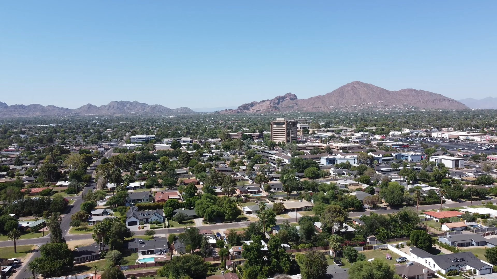
    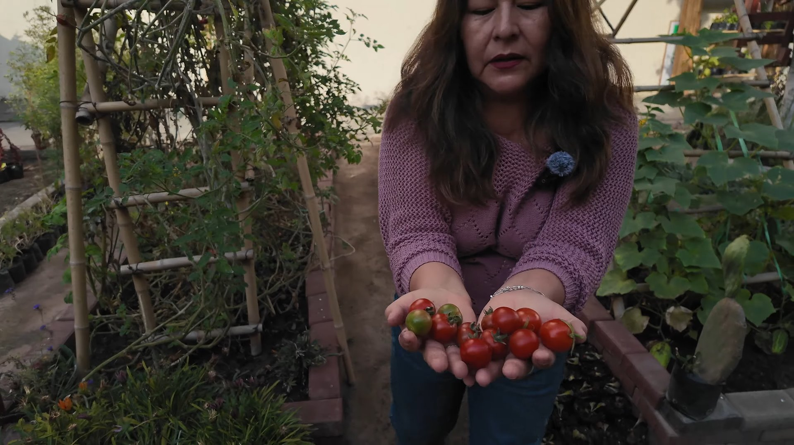
    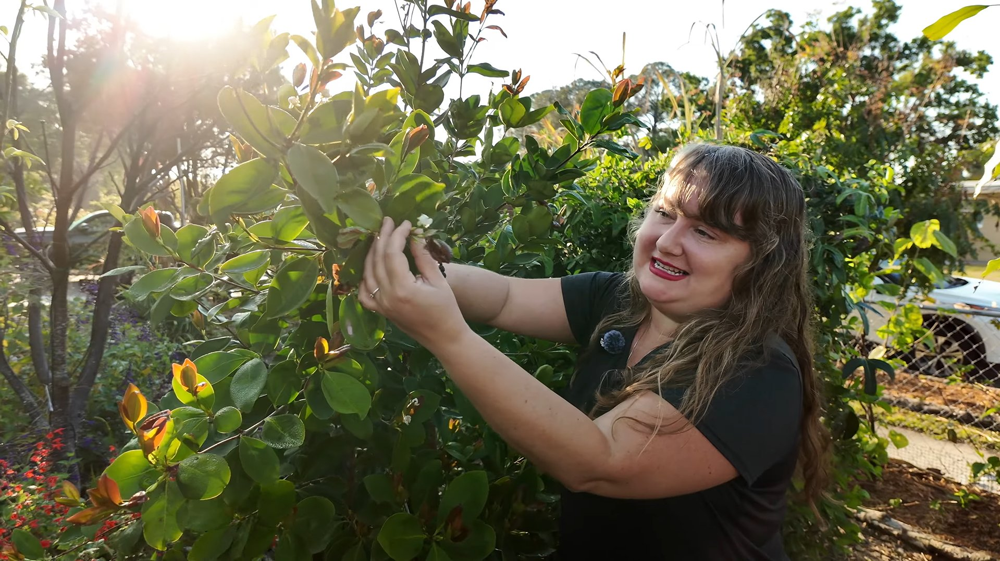
    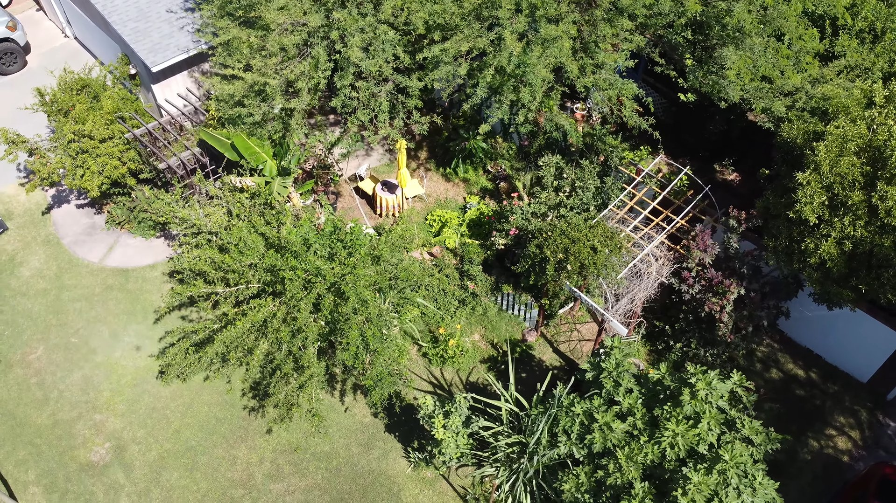
    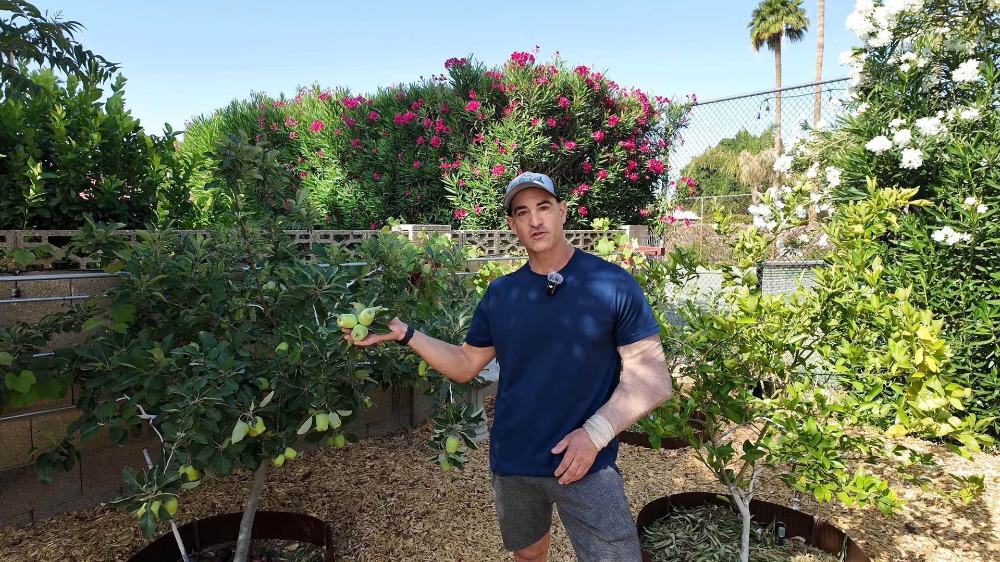
    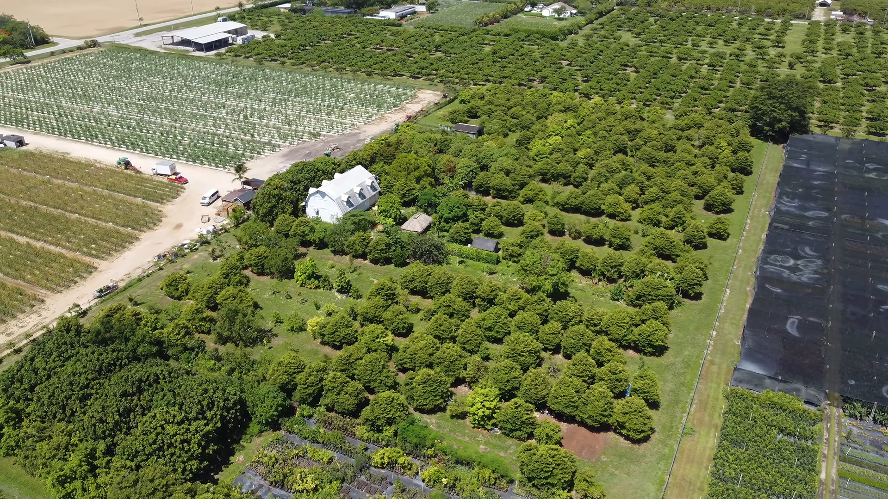
    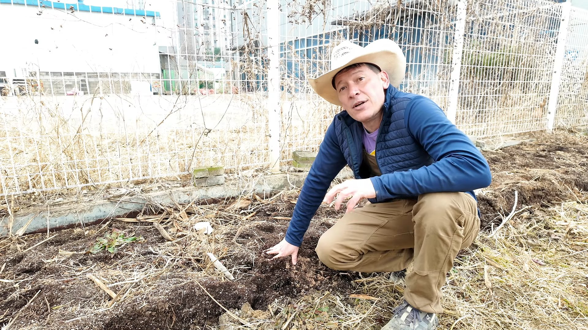
    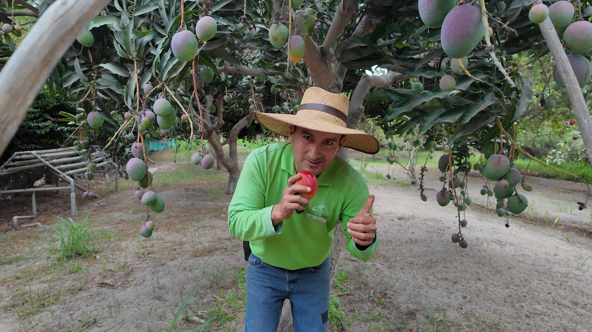
    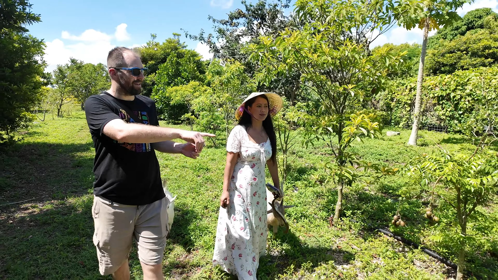
    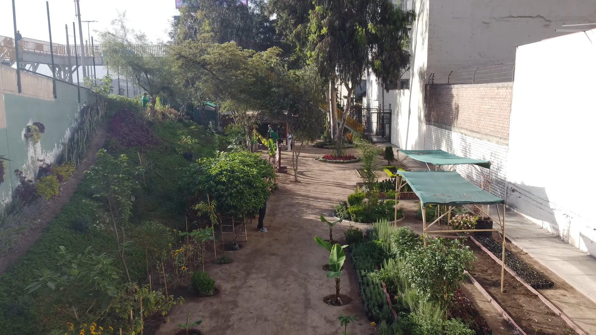
    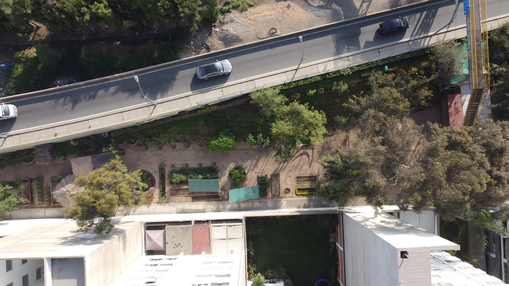
    
    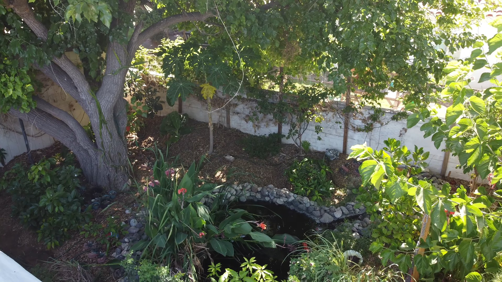
    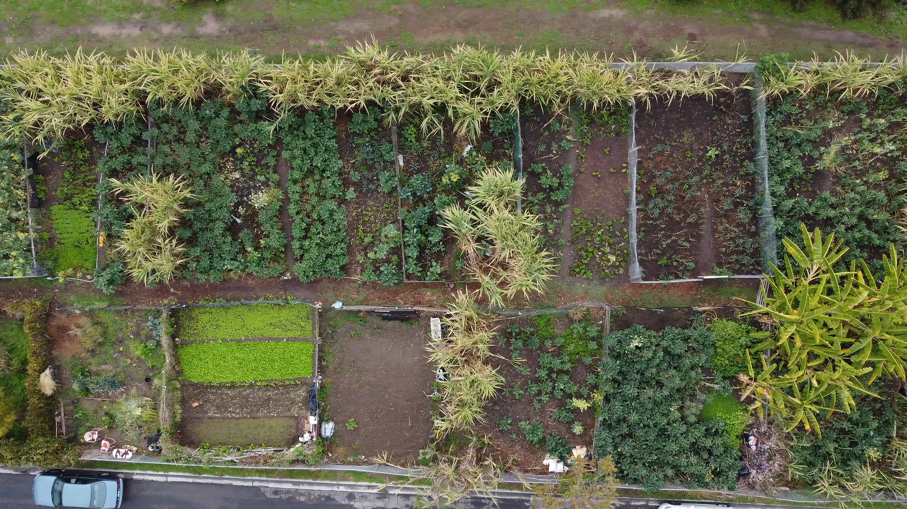
    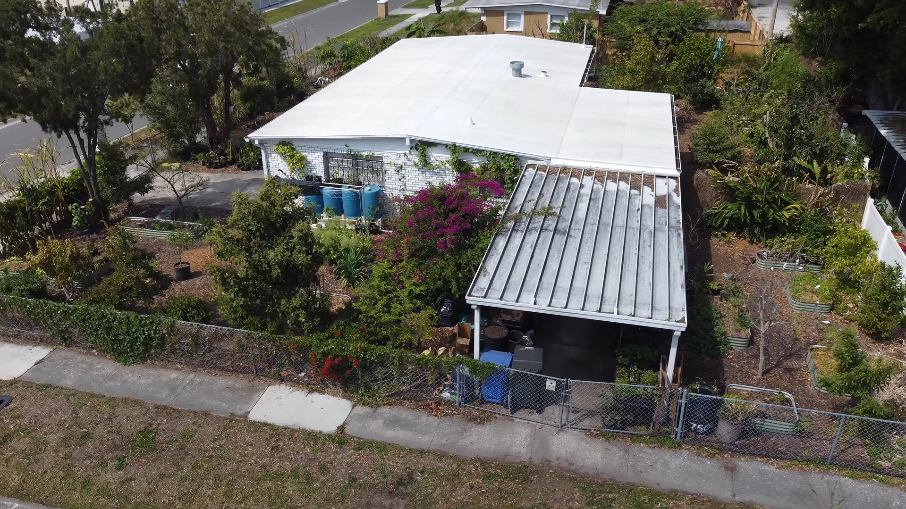
    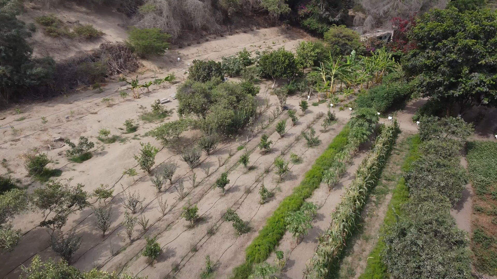
  </div>

  <div class="gy-overlay"></div>

  <div class="gy-content">

    <p class="gy-description">
      Join us as we explore food forests, edible landscapes, and the inspiring
      people creating abundance through plants and food in different places.
    </p>

    <div class="gy-buttons">
      <a class="gy-button gy-button-primary" href="videos.html">
        Explore the Tours
      </a>

      <a
        class="gy-button gy-button-secondary"
        href="https://www.youtube.com/@thegreenyardaz"
        target="_blank"
        rel="noopener">
        ▶ Watch on YouTube
      </a>
    </div>

  </div>

</section>


<section class="gy-discover-section">

  <div class="gy-discover-grid">

    <article class="gy-featured-tour">

      <div class="gy-section-label">Featured Tour</div>

      <h2>
        Touring a Four-Year-Old Tropical Food Forest in Phoenix
      </h2>

      <p>
        Step inside a four-year-old Phoenix food forest and see how tropical
        fruit trees, thoughtful design, and dense planting can create abundance
        in the desert.
      </p>

      <a
        class="gy-watch-button"
        href="https://www.youtube.com/watch?v=chvUg6YmvGQ"
        target="_blank"
        rel="noopener">
        ▶ Watch Now
      </a>

      <a
        class="gy-featured-image"
        href="https://www.youtube.com/watch?v=chvUg6YmvGQ"
        target="_blank"
        rel="noopener"
        aria-label="Watch the featured Phoenix food forest tour">

        

        <span class="gy-featured-play">▶</span>

      </a>

    </article>


    <section class="gy-location-panel">

      <div class="gy-section-label">Explore by Location</div>

      <h2>Discover Abundance Around the World</h2>

      <p class="gy-location-intro">
        Explore food forests, edible landscapes, farms, and community gardens
        through the people and places that make each location unique.
      </p>

      <div class="gy-location-grid">

        <a class="gy-location-card" href="videos.html">
          
          <span class="gy-location-shade"></span>
          <span class="gy-location-name">Arizona</span>
          <span class="gy-location-link">Explore Tours →</span>
        </a>

        <a class="gy-location-card" href="videos.html">
          
          <span class="gy-location-shade"></span>
          <span class="gy-location-name">Florida</span>
          <span class="gy-location-link">Explore Tours →</span>
        </a>

        <a class="gy-location-card" href="videos.html">
          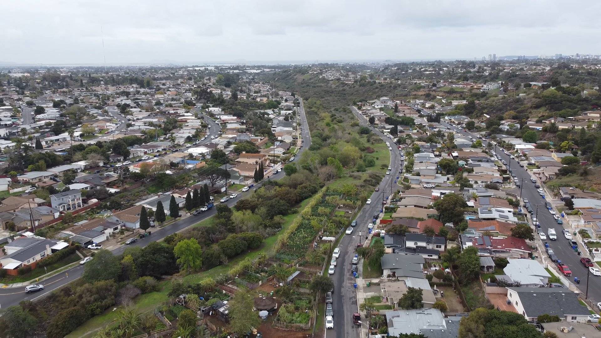
          <span class="gy-location-shade"></span>
          <span class="gy-location-name">California</span>
          <span class="gy-location-link">Explore Tours →</span>
        </a>

        <a class="gy-location-card" href="videos.html">
          
          <span class="gy-location-shade"></span>
          <span class="gy-location-name">Peru</span>
          <span class="gy-location-link">Explore Tours →</span>
        </a>

        <a class="gy-location-card" href="videos.html">
          
          <span class="gy-location-shade"></span>
          <span class="gy-location-name">South Korea</span>
          <span class="gy-location-link">Explore Tours →</span>
        </a>

      </div>

      <p class="gy-map-note">
        More locations—and an interactive world map—are coming as our tours grow.
      </p>

    </section>

  </div>

</section>


<script>
(function () {
  function startSlideshow() {
    const slides = document.querySelectorAll("#gy-home-hero .gy-slide");

    if (slides.length < 2) {
      return;
    }

    let current = 0;

    window.setInterval(function () {
      slides[current].classList.remove("is-active");
      current = (current + 1) % slides.length;
      slides[current].classList.add("is-active");
    }, 6500);
  }

  if (document.readyState === "loading") {
    document.addEventListener("DOMContentLoaded", startSlideshow);
  } else {
    startSlideshow();
  }
})();
</script>
```
