```{=html}
<style>
  /* =========================================================
     TOURS LANDING PAGE
     ========================================================= */

  body:has(#gy-tours-hero) {
    overflow-x: hidden !important;
  }

  body:has(#gy-tours-hero) #title-block-header,
  body:has(#gy-tours-hero) .quarto-title-block {
    display: none !important;
  }

  body:has(#gy-tours-hero) #quarto-content,
  body:has(#gy-tours-hero) main.content,
  body:has(#gy-tours-hero) .page-columns,
  body:has(#gy-tours-hero) .content,
  body:has(#gy-tours-hero) .content-block {
    width: 100% !important;
    max-width: none !important;
    margin: 0 !important;
    padding: 0 !important;
  }

  body:has(#gy-tours-hero) main.content {
    padding-top: 0 !important;
    margin-top: 0 !important;
  }


  /* =========================================================
     FULL-WIDTH ROTATING HERO
     ========================================================= */

  #gy-tours-hero {
    position: relative;

    width: 100vw !important;
    max-width: none !important;

    left: 50% !important;
    margin-left: -50vw !important;
    margin-right: 0 !important;
    margin-top: 10px;

    min-height: 610px;

    overflow: hidden;
    display: flex;
    align-items: center;
    isolation: isolate;

    background: #082f24;
  }

  #gy-tours-hero .gy-tours-slideshow {
    position: absolute;
    inset: 0;
    z-index: 0;

    width: 100%;
    height: 100%;
    overflow: hidden;
    background: #082f24;
  }

  #gy-tours-hero .gy-tours-slide {
    position: absolute;
    inset: 0;

    display: block;
    width: 100%;
    height: 100%;
    max-width: none;

    margin: 0;
    padding: 0;
    border: 0;

  object-fit: cover;
object-position: center;

    opacity: 0;

    transition: opacity 1.5s ease-in-out;

    pointer-events: none;
  }

  #gy-tours-hero .gy-tours-slide.is-active {
    opacity: 1;
  }

  #gy-tours-hero .gy-tours-overlay {
    position: absolute;
    inset: 0;
    z-index: 1;

    background:
      linear-gradient(
        90deg,
        rgba(3, 29, 22, 0.97) 0%,
        rgba(3, 29, 22, 0.88) 34%,
        rgba(3, 29, 22, 0.55) 62%,
        rgba(3, 29, 22, 0.24) 100%
      );

    pointer-events: none;
  }

  #gy-tours-hero .gy-tours-content {
    position: relative;
    z-index: 2;

    width: min(790px, 90%);
    margin-left: max(5vw, 45px);
    padding: 75px 0;

    color: #ffffff;
  }

  .gy-tours-kicker {
    display: block;
    margin: 0 0 17px;

    color: #d6ed91;
    font-family: Arial, Helvetica, sans-serif;
    font-size: 12px;
    font-weight: 800;
    line-height: 1.2;
    letter-spacing: 0.15em;
    text-transform: uppercase;

    text-shadow: 0 2px 8px rgba(0, 0, 0, 0.36);
  }

  #gy-tours-hero h1 {
    max-width: 790px;
    margin: 0 0 24px !important;

    color: #ffffff;
    font-family: Georgia, "Times New Roman", serif;
    font-size: clamp(43px, 4.6vw, 72px) !important;
    font-weight: 600 !important;
    line-height: 1.04 !important;
    letter-spacing: -0.025em !important;
    text-transform: none !important;

    text-shadow: 0 3px 13px rgba(0, 0, 0, 0.46);
  }

  #gy-tours-hero p {
    max-width: 690px;
    margin: 0 0 32px;

    color: rgba(255, 255, 255, 0.96);
    font-family: Arial, Helvetica, sans-serif;
    font-size: 19px;
    line-height: 1.65;

    text-shadow: 0 2px 8px rgba(0, 0, 0, 0.38);
  }

  .gy-tours-button {
    display: inline-flex;
    align-items: center;
    justify-content: center;

    min-height: 54px;
    padding: 14px 25px;

    color: #ffffff !important;
    background: #256844;
    border: 1px solid #256844;
    border-radius: 5px;

    font-family: Arial, Helvetica, sans-serif;
    font-size: 13px;
    font-weight: 800;
    line-height: 1;
    letter-spacing: 0.045em;
    text-decoration: none !important;
    text-transform: uppercase;

    transition:
      transform 0.2s ease,
      background-color 0.2s ease;
  }

  .gy-tours-button:hover {
    color: #ffffff !important;
    background: #317b53;
    transform: translateY(-2px);
  }


  /* =========================================================
     MAIN PAGE CONTENT
     ========================================================= */

 .gy-tours-main {
  width: 100%;
  max-width: none;
  margin: 0;
  padding: 76px 5vw 28px;
  box-sizing: border-box;
}
  .gy-section-heading {
    max-width: 850px;
    margin: 0 0 33px;
  }

  .gy-section-label {
    display: block;
    margin: 0 0 10px;

    color: #597548;
    font-family: Arial, Helvetica, sans-serif;
    font-size: 12px;
    font-weight: 800;
    line-height: 1.2;
    letter-spacing: 0.14em;
    text-transform: uppercase;
  }

  .gy-section-heading h2 {
    margin: 0 0 15px !important;

    color: #17382c;
    font-family: Georgia, "Times New Roman", serif;
    font-size: clamp(34px, 3.5vw, 52px) !important;
    font-weight: 600 !important;
    line-height: 1.1 !important;
    letter-spacing: -0.02em !important;
    text-transform: none !important;
  }

  .gy-section-heading p {
    max-width: 790px;
    margin: 0;

    color: #52615b;
    font-family: Arial, Helvetica, sans-serif;
    font-size: 17px;
    line-height: 1.7;
  }


  /* =========================================================
     BROWSE BY LOCATION
     ========================================================= */

  .gy-location-section {
    margin: 0 0 78px;
  }

  .gy-location-grid {
    display: grid;
    grid-template-columns: repeat(5, minmax(0, 1fr));
    gap: 17px;
  }

  .gy-location-card {
    position: relative;

    display: block;
    min-height: 260px;

    overflow: hidden;
    border-radius: 7px;

    color: #ffffff !important;
    background: #17382c;
    text-decoration: none !important;

    box-shadow: 0 9px 25px rgba(18, 47, 36, 0.13);

    transition:
      transform 0.22s ease,
      box-shadow 0.22s ease;
  }

  .gy-location-card img {
    position: absolute;
    inset: 0;

    display: block;
    width: 100%;
    height: 100%;

    object-fit: cover;

    transition: transform 0.55s ease;
  }

  .gy-location-card::after {
    content: "";

    position: absolute;
    inset: 0;

    background:
      linear-gradient(
        to top,
        rgba(3, 29, 22, 0.95) 0%,
        rgba(3, 29, 22, 0.42) 55%,
        rgba(3, 29, 22, 0.06) 100%
      );
  }

  .gy-location-copy {
    position: absolute;
    left: 20px;
    right: 20px;
    bottom: 19px;
    z-index: 2;
  }

  .gy-location-name {
    display: block;
    margin-bottom: 7px;

    color: #ffffff;
    font-family: Georgia, "Times New Roman", serif;
    font-size: 25px;
    font-weight: 600;
    line-height: 1.1;
  }

  .gy-location-link {
    display: block;

    color: #d6ed91;
    font-family: Arial, Helvetica, sans-serif;
    font-size: 10px;
    font-weight: 800;
    letter-spacing: 0.07em;
    text-transform: uppercase;
  }

  .gy-location-card:hover {
    transform: translateY(-4px);
    box-shadow: 0 15px 31px rgba(18, 47, 36, 0.18);
  }

  .gy-location-card:hover img {
    transform: scale(1.07);
  }


  /* =========================================================
     MISSION
     ========================================================= */

  .gy-tour-mission {
    display: grid;
    grid-template-columns: minmax(280px, 0.72fr) minmax(0, 1.28fr);
    gap: clamp(35px, 5vw, 78px);
    align-items: center;

    margin: 0 0 82px;
    padding: clamp(37px, 5vw, 64px);

    border-radius: 9px;
    background: #123d2d;
  }

  .gy-tour-mission h2 {
    margin: 0 !important;

    color: #ffffff;
    font-family: Georgia, "Times New Roman", serif;
    font-size: clamp(34px, 3.6vw, 54px) !important;
    font-weight: 600 !important;
    line-height: 1.09 !important;
    letter-spacing: -0.025em !important;
    text-transform: none !important;
  }

  .gy-tour-mission p {
    margin: 0;

    color: rgba(255, 255, 255, 0.9);
    font-family: Arial, Helvetica, sans-serif;
    font-size: 17px;
    line-height: 1.8;
  }


  /* =========================================================
     AUTOMATIC TOUR LISTING
     ========================================================= */

.gy-library-intro {
  width: 100%;
  max-width: none;
  margin: 0;
  padding: 0 5vw 4px;
  box-sizing: border-box;
}

#listing-listing,
.quarto-listing-container-default {
  width: 100%;
  max-width: none !important;
  margin: 0 0 90px !important;
  padding: 0 5vw !important;
  box-sizing: border-box;
}

  .quarto-listing {
    margin-top: 25px !important;
  }

  .quarto-listing .grid {
    gap: 25px !important;
  }

  .quarto-grid-item {
    overflow: hidden;

    border: 1px solid rgba(7, 56, 44, 0.13) !important;
    border-radius: 9px !important;

    background: #ffffff !important;
    box-shadow: 0 8px 24px rgba(18, 47, 36, 0.08);

    transition:
      transform 0.2s ease,
      box-shadow 0.2s ease;
  }

  .quarto-grid-item:hover {
    transform: translateY(-4px);
    box-shadow: 0 14px 31px rgba(18, 47, 36, 0.14);
  }

 .quarto-grid-item .card-img-top,
.quarto-grid-item img {
  display: block;
  width: 100%;
  aspect-ratio: 16 / 9;
  object-fit: cover;
  object-position: center;
}

  .quarto-grid-item .card-body {
    padding: 22px !important;
  }

  .quarto-grid-item .card-title {
    margin-bottom: 11px !important;

    color: #153e30 !important;
    font-family: Georgia, "Times New Roman", serif !important;
    font-size: 23px !important;
    font-weight: 600 !important;
    line-height: 1.22 !important;
    text-transform: none !important;
  }

  .quarto-grid-item .card-text {
    color: #53645d !important;
    font-family: Arial, Helvetica, sans-serif !important;
    font-size: 14px !important;
    line-height: 1.65 !important;
  }

  .quarto-grid-item .listing-date {
    color: #718078 !important;
    font-family: Arial, Helvetica, sans-serif !important;
    font-size: 12px !important;
  }


  /* =========================================================
     TABLET
     ========================================================= */

  @media (max-width: 1050px) {
    .gy-location-grid {
      grid-template-columns: repeat(3, minmax(0, 1fr));
    }

    .gy-tour-mission {
      grid-template-columns: 1fr;
      gap: 24px;
    }
  }


  /* =========================================================
     MOBILE
     ========================================================= */

  @media (max-width: 700px) {
    #gy-tours-hero {
      min-height: 610px;
      align-items: flex-end;
    }

    #gy-tours-hero .gy-tours-overlay {
      background: rgba(3, 29, 22, 0.72);
    }

    #gy-tours-hero .gy-tours-content {
      width: 100%;
      margin: 0;
      padding: 50px 24px 45px;
      box-sizing: border-box;
    }

    #gy-tours-hero h1 {
      font-size: clamp(39px, 11vw, 52px) !important;
      line-height: 1.04 !important;
    }

    #gy-tours-hero p {
      max-width: 100%;
      font-size: 16px;
      line-height: 1.58;
    }

    .gy-tours-button {
      width: 100%;
      box-sizing: border-box;
    }

    .gy-tours-main,
    .gy-library-intro,
    #listing-listing,
    .quarto-listing-container-default {
      width: calc(100% - 40px);
    }

    .gy-tours-main {
      padding-top: 58px;
    }

    .gy-location-grid {
      grid-template-columns: 1fr;
    }

    .gy-location-card {
      min-height: 245px;
    }

    .gy-location-name {
      font-size: 27px;
    }

    .gy-tour-mission {
      margin-bottom: 64px;
      padding: 33px 25px;
    }
  }

  @media (prefers-reduced-motion: reduce) {
    #gy-tours-hero .gy-tours-slide {
      transition: opacity 0.4s ease;
    }
  }
</style>

<section id="gy-tours-hero">

<div class="gy-tours-slideshow" aria-hidden="true">

  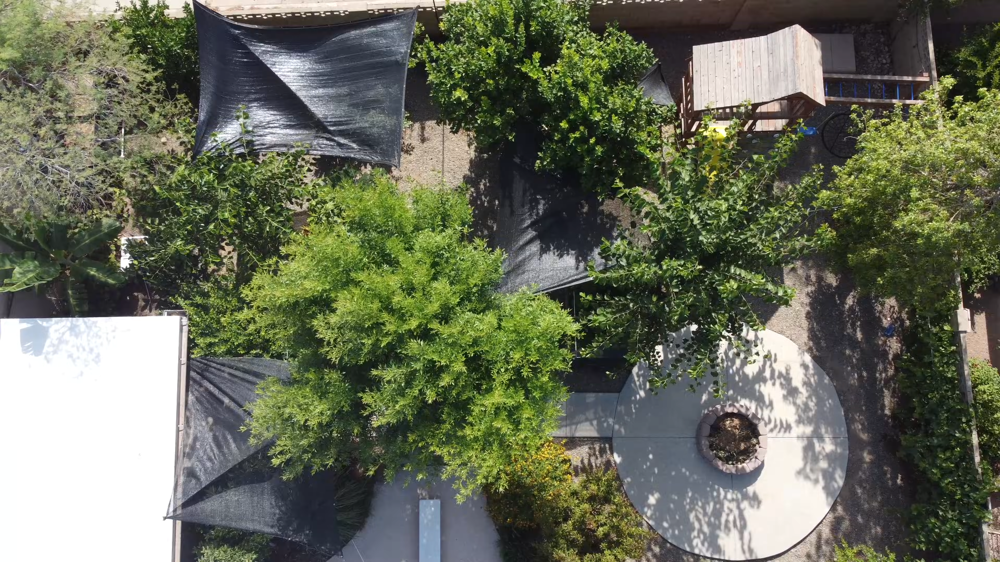

  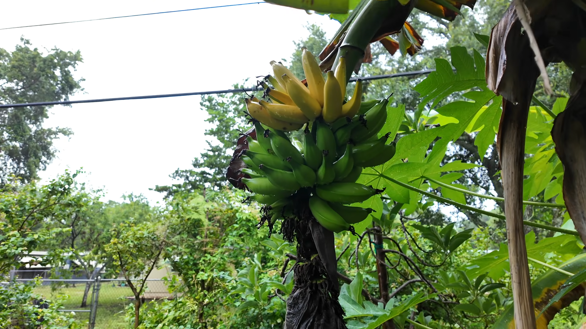

  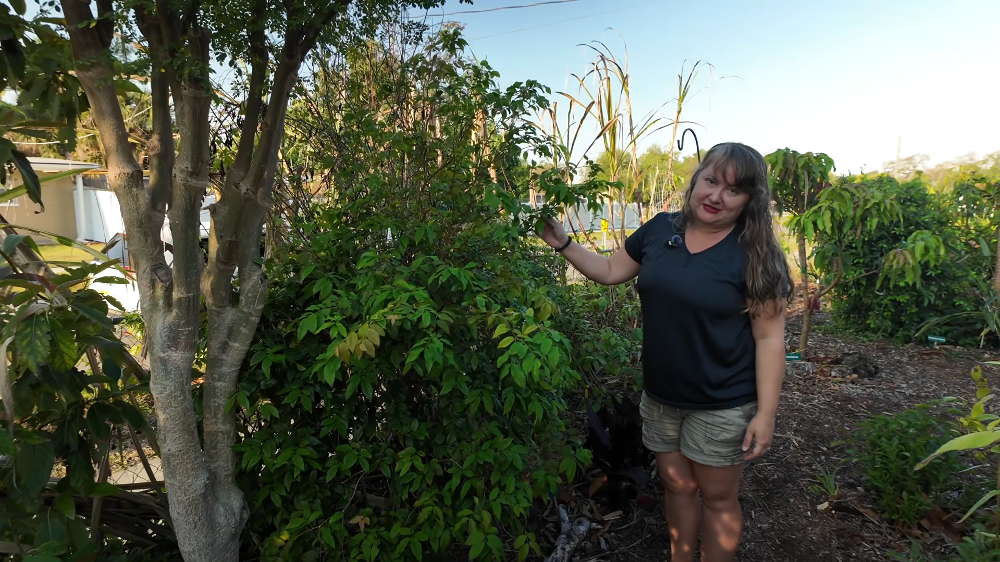

  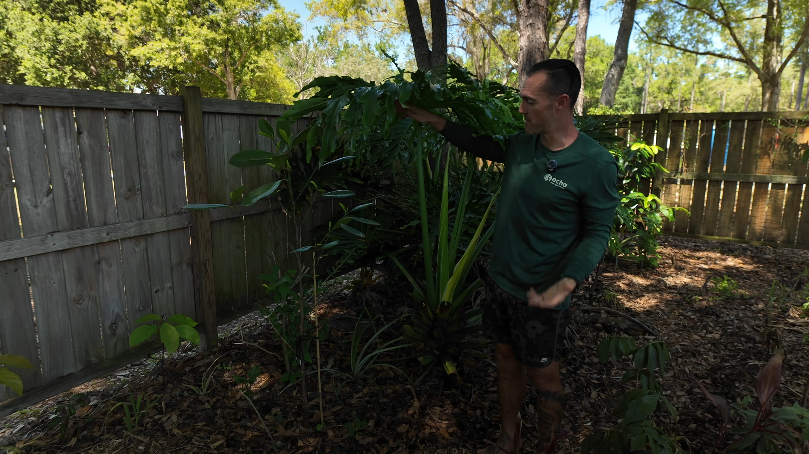

  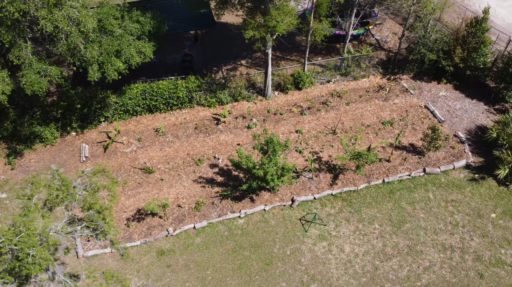

  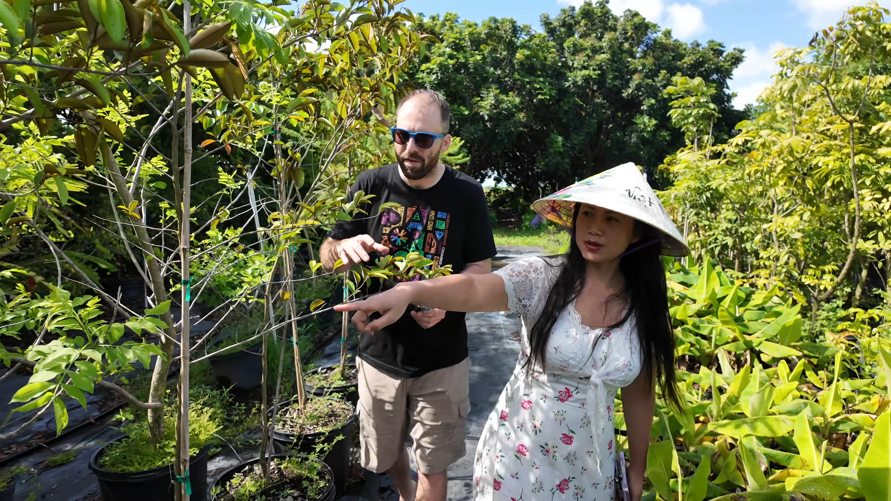

  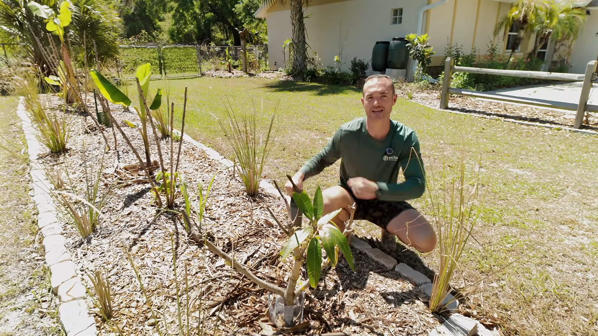

  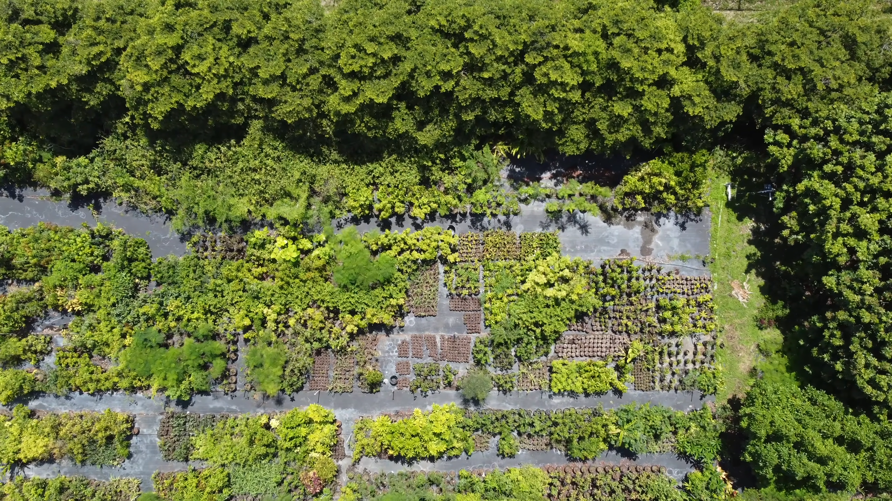

  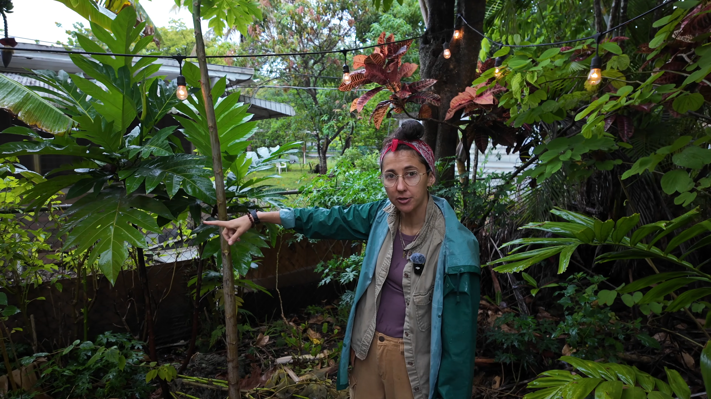

</div>
  <div class="gy-tours-overlay"></div>

  <div class="gy-tours-content">

    <span class="gy-tours-kicker">
      The Green Yard Tour Library
    </span>

    <h1>
      Explore Abundance Around the World
    </h1>

    <p>
      Step inside food forests, edible landscapes, farms, orchards, and
      community gardens—and meet the people creating abundance through
      plants and food in different places.
    </p>

    <a class="gy-tours-button" href="#all-tours">
      Explore All Tours
    </a>

  </div>

</section>


<main class="gy-tours-main">

  <section class="gy-location-section">

    <div class="gy-section-heading">

      <span class="gy-section-label">
        Browse the World
      </span>

      <h2>
        Explore by Location
      </h2>

      <p>
        Discover how climate, culture, people, and place shape edible
        landscapes across the United States and around the world.
      </p>

    </div>

    <div class="gy-location-grid">

      <a class="gy-location-card" href="#all-tours">

        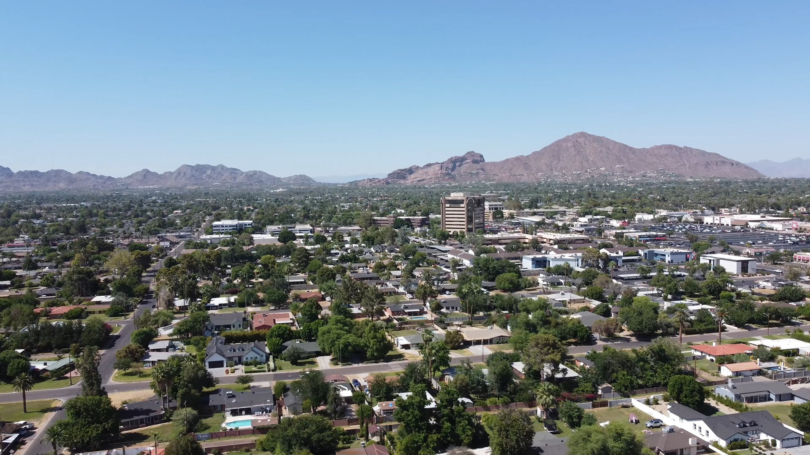

        <span class="gy-location-copy">
          <span class="gy-location-name">Arizona</span>
          <span class="gy-location-link">Explore Tours →</span>
        </span>

      </a>


      <a class="gy-location-card" href="#all-tours">

        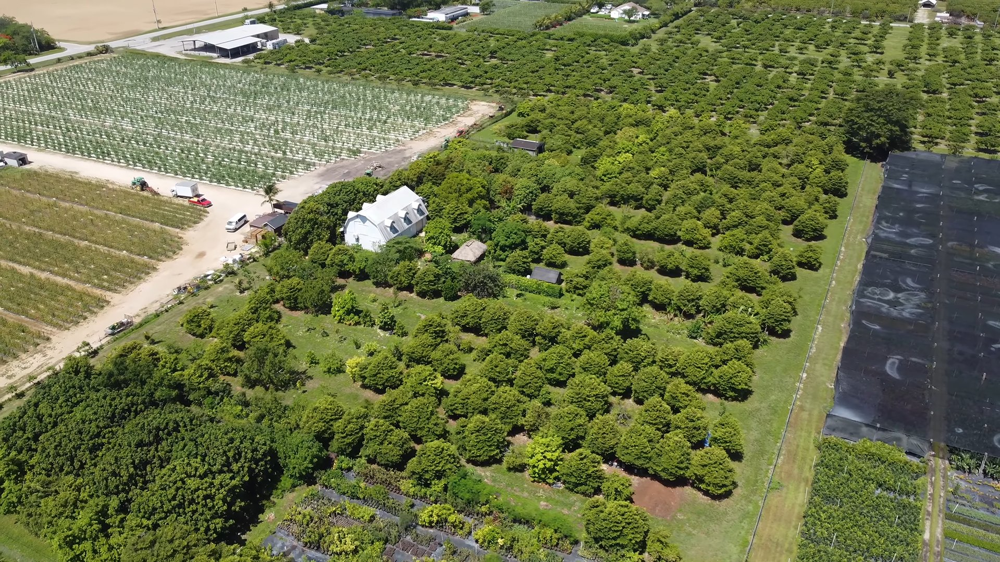

        <span class="gy-location-copy">
          <span class="gy-location-name">Florida</span>
          <span class="gy-location-link">Explore Tours →</span>
        </span>

      </a>


      <a class="gy-location-card" href="#all-tours">

        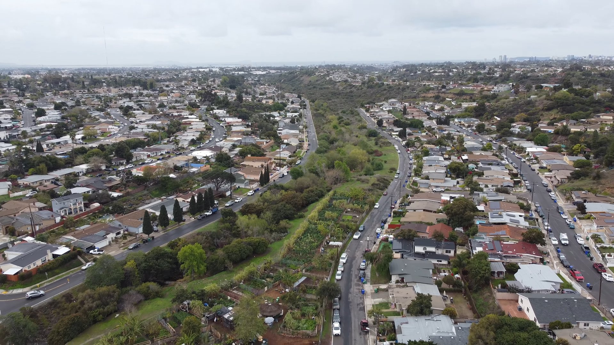

        <span class="gy-location-copy">
          <span class="gy-location-name">California</span>
          <span class="gy-location-link">Explore Tours →</span>
        </span>

      </a>


      <a class="gy-location-card" href="#all-tours">

        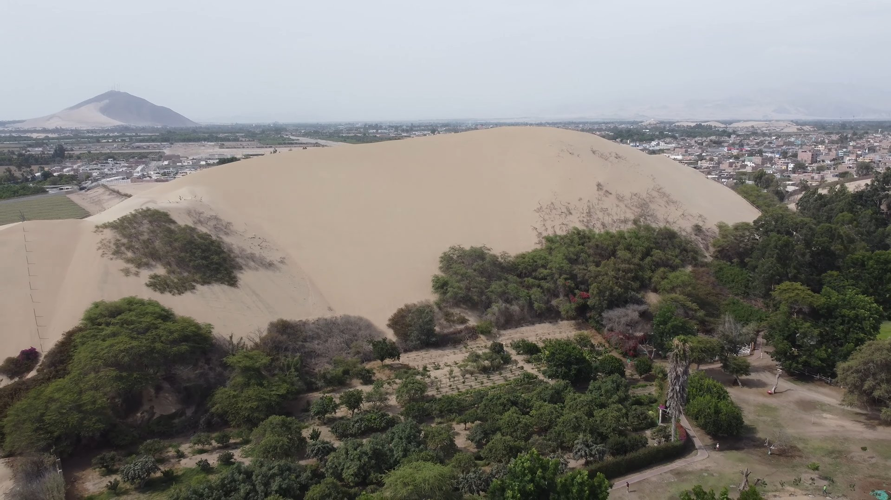

        <span class="gy-location-copy">
          <span class="gy-location-name">Peru</span>
          <span class="gy-location-link">Explore Tours →</span>
        </span>

      </a>


      <a class="gy-location-card" href="#all-tours">

        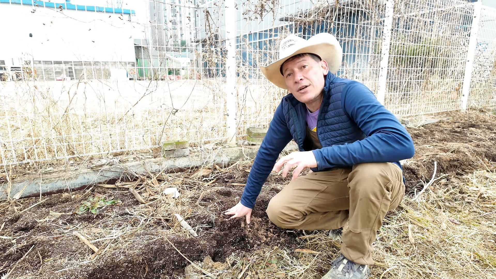

        <span class="gy-location-copy">
          <span class="gy-location-name">South Korea</span>
          <span class="gy-location-link">Explore Tours →</span>
        </span>

      </a>

    </div>

  </section>


  <section class="gy-tour-mission">

    <h2>
      What Does Abundance Look Like Around the World?
    </h2>

    <p>
      There is no single way to create an abundant landscape. Some people
      transform a small front yard, while others manage farms, orchards,
      nurseries, community gardens, or tropical food forests. The Green Yard
      documents those different approaches while keeping the people and their
      stories at the center of every tour.
    </p>

  </section>

</main>


<section id="all-tours" class="gy-library-intro">

  <div class="gy-section-heading">

    <span class="gy-section-label">
      The Complete Library
    </span>

    <h2>
      Explore All Tours
    </h2>

    <p>
      Browse every completed tour profile. New tours will automatically appear
      here as the library grows.
    </p>

  </div>

</section>


<script>
(function () {
  function startToursSlideshow() {
    const slides = document.querySelectorAll(
      "#gy-tours-hero .gy-tours-slide"
    );

    if (slides.length < 2) {
      return;
    }

    let current = 0;

    window.setInterval(function () {
      slides[current].classList.remove("is-active");
      current = (current + 1) % slides.length;
      slides[current].classList.add("is-active");
    }, 6500);
  }

  if (document.readyState === "loading") {
    document.addEventListener(
      "DOMContentLoaded",
      startToursSlideshow
    );
  } else {
    startToursSlideshow();
  }
})();
</script>
```
