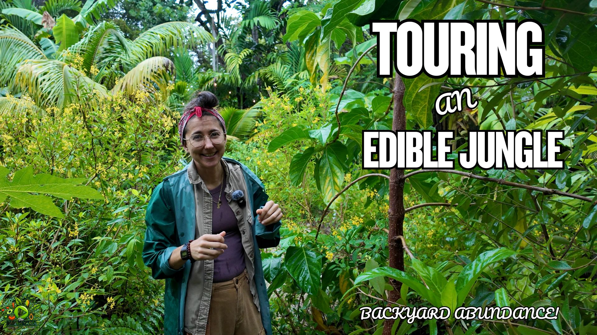

<style>

/* =========================================================
   QUARTO PAGE OVERRIDES
   ========================================================= */

.quarto-title-block,
#title-block-header {
  display: none !important;
}

.tour-page {
  max-width: 1180px;
  margin: 0 auto;
  padding: 26px 0 70px;
}


/* =========================================================
   MAIN VIDEO
   ========================================================= */

.video-wrap {
  position: relative;
  width: 100%;
  aspect-ratio: 16 / 9;
  overflow: hidden;
  margin: 0 0 24px;
  border-radius: 10px;
  background: #082f25;
  box-shadow: 0 14px 34px rgba(7, 56, 44, 0.16);
}

.video-wrap iframe {
  position: absolute;
  inset: 0;
  width: 100%;
  height: 100%;
  border: 0;
}


/* =========================================================
   BREADCRUMBS
   ========================================================= */

.breadcrumbs {
  display: flex;
  flex-wrap: wrap;
  align-items: center;
  gap: 8px;
  margin: 0 0 26px;
  color: #6b7771;
  font-family: Arial, Helvetica, sans-serif;
  font-size: 0.82rem;
  line-height: 1.4;
}

.breadcrumbs a {
  color: #315f49 !important;
  text-decoration: none !important;
}

.breadcrumbs a:hover {
  text-decoration: underline !important;
}

.breadcrumb-separator {
  color: #a1aaa6;
}


/* =========================================================
   TOUR HEADER
   ========================================================= */

.tour-header {
  max-width: 1050px;
  margin: 0 0 42px;
}

.tour-header h1 {
  margin: 0 0 20px;
  color: #17221e;
  font-family: Arial, Helvetica, sans-serif;
  font-size: clamp(2.25rem, 5vw, 4.25rem);
  font-weight: 400;
  letter-spacing: 0.035em;
  line-height: 1.08;
  text-transform: uppercase;
}

.tour-categories {
  display: flex;
  flex-wrap: wrap;
  gap: 9px;
  margin-bottom: 18px;
}

.tour-category {
  display: inline-flex;
  padding: 7px 12px;
  border: 1px solid #aeb5b1;
  border-radius: 5px;
  color: #707873;
  background: #ffffff;
  font-size: 0.77rem;
  letter-spacing: 0.07em;
  line-height: 1;
  text-transform: uppercase;
}

.tour-description {
  max-width: 1050px;
  margin: 0 0 25px;
  color: #59625f;
  font-size: 1.13rem;
  line-height: 1.65;
}

.tour-meta {
  display: grid;
  grid-template-columns: repeat(2, minmax(200px, 1fr));
  max-width: 720px;
  gap: 26px;
}

.meta-label {
  display: block;
  margin-bottom: 4px;
  color: #858c89;
  font-size: 0.79rem;
  letter-spacing: 0.07em;
  text-transform: uppercase;
}

.meta-value {
  color: #59625f;
  font-size: 1rem;
}

.tour-lead {
  max-width: 930px;
  margin: 0 0 40px;
  color: #4b5e56;
  font-size: 1.18rem;
  line-height: 1.75;
}


/* =========================================================
   TOUR SNAPSHOT
   ========================================================= */

.quick-facts {
  display: grid;
  grid-template-columns: repeat(4, minmax(0, 1fr));
  gap: 15px;
  margin: 0 0 54px;
}

.fact-card {
  padding: 19px;
  border: 1px solid rgba(7, 56, 44, 0.14);
  border-radius: 8px;
  background: #f7f5ef;
}

.fact-label {
  display: block;
  margin-bottom: 6px;
  color: #658042;
  font-size: 0.72rem;
  font-weight: 800;
  letter-spacing: 0.09em;
  text-transform: uppercase;
}

.fact-value {
  color: #153e30;
  font-family: Georgia, "Times New Roman", serif;
  font-size: 1.15rem;
  font-weight: 600;
  line-height: 1.3;
}


/* =========================================================
   GENERAL SECTIONS
   ========================================================= */

.tour-section {
  margin: 58px 0;
}

.tour-section h2 {
  margin-bottom: 20px;
  color: #143d2f;
  font-family: Georgia, "Times New Roman", serif;
  font-size: clamp(2rem, 3vw, 2.7rem);
  line-height: 1.15;
}

.tour-section p,
.tour-section li {
  color: #44554e;
  font-size: 1.05rem;
  line-height: 1.75;
}


/* =========================================================
   LEARNING GRID
   ========================================================= */

.learn-grid {
  display: grid;
  grid-template-columns: repeat(2, minmax(0, 1fr));
  gap: 14px;
  margin-top: 24px;
}

.learn-item {
  padding: 17px 19px;
  border-left: 4px solid #86a842;
  background: #f7f5ef;
  color: #28473b;
  line-height: 1.5;
}


/* =========================================================
   PLANT COLLECTION SUMMARY
   ========================================================= */

.species-overview {
  margin: 25px 0 17px;
  padding: 25px;
  border-radius: 9px;
  background: #f7f5ef;
}

.species-overview-grid {
  display: grid;
  grid-template-columns: repeat(4, minmax(0, 1fr));
  gap: 14px;
}

.species-stat {
  padding: 17px;
  border: 1px solid rgba(7, 56, 44, 0.13);
  border-radius: 7px;
  background: #ffffff;
}

.species-stat-label {
  display: block;
  margin-bottom: 6px;
  color: #718a4a;
  font-family: Arial, Helvetica, sans-serif;
  font-size: 0.7rem;
  font-weight: 800;
  letter-spacing: 0.085em;
  text-transform: uppercase;
}

.species-stat-value {
  display: block;
  color: #173f30;
  font-family: Georgia, "Times New Roman", serif;
  font-size: 1.07rem;
  font-weight: 600;
  line-height: 1.3;
}


/* =========================================================
   FEATURED PLANTS
   ========================================================= */

.featured-plants {
  margin: 18px 0 20px;
}

.featured-plants-label {
  display: block;
  margin-bottom: 10px;
  color: #597548;
  font-family: Arial, Helvetica, sans-serif;
  font-size: 0.72rem;
  font-weight: 800;
  letter-spacing: 0.09em;
  text-transform: uppercase;
}

.featured-plant-tags {
  display: flex;
  flex-wrap: wrap;
  gap: 9px;
}

.featured-plant {
  display: inline-flex;
  padding: 8px 12px;
  border: 1px solid rgba(7, 56, 44, 0.17);
  border-radius: 999px;
  color: #315747;
  background: #ffffff;
  font-size: 0.85rem;
  line-height: 1.2;
}


/* =========================================================
   EXPANDABLE PLANT LIST
   ========================================================= */

.species-details {
  margin-top: 15px;
}

.species-details summary {
  display: inline-flex;
  align-items: center;
  justify-content: center;
  min-height: 48px;
  padding: 12px 22px;
  border-radius: 5px;
  background: #174936;
  color: #ffffff;
  cursor: pointer;
  font-family: Arial, Helvetica, sans-serif;
  font-size: 0.78rem;
  font-weight: 800;
  letter-spacing: 0.045em;
  list-style: none;
  text-transform: uppercase;
  transition:
    transform 0.2s ease,
    background-color 0.2s ease;
}

.species-details summary::-webkit-details-marker {
  display: none;
}

.species-details summary:hover {
  background: #286348;
  transform: translateY(-2px);
}

.species-summary-open {
  display: none;
}

.species-details[open] .species-summary-closed {
  display: none;
}

.species-details[open] .species-summary-open {
  display: inline;
}

.species-box {
  margin-top: 22px;
  padding: 28px 30px;
  border-radius: 9px;
  background: #f7f5ef;
}

.species-box h3 {
  margin-top: 25px;
  color: #173f30;
  font-family: Georgia, "Times New Roman", serif;
}

.species-box h3:first-child {
  margin-top: 0;
}

.species-list {
  columns: 3;
  column-gap: 35px;
}

.species-list li {
  break-inside: avoid;
  margin-bottom: 7px;
}


/* =========================================================
   TAKEAWAY
   ========================================================= */

.takeaway {
  padding: 25px 28px;
  border-left: 5px solid #86a842;
  border-radius: 0 8px 8px 0;
  background: #f7f5ef;
}


/* =========================================================
   RESOURCE LINKS
   ========================================================= */

.link-grid {
  display: grid;
  grid-template-columns: repeat(2, minmax(0, 1fr));
  gap: 15px;
  margin-top: 24px;
}

.resource-card {
  display: block;
  padding: 21px;
  border: 1px solid rgba(7, 56, 44, 0.14);
  border-radius: 8px;
  background: #ffffff;
  color: #173f30 !important;
  text-decoration: none !important;
  transition:
    transform 0.15s ease,
    box-shadow 0.15s ease;
}

.resource-card:hover {
  transform: translateY(-2px);
  box-shadow: 0 10px 24px rgba(18, 47, 36, 0.1);
}

.resource-card strong {
  display: block;
  margin-bottom: 5px;
  font-family: Georgia, "Times New Roman", serif;
  font-size: 1.15rem;
}

.resource-card span {
  color: #53645d;
  font-size: 0.92rem;
  line-height: 1.5;
}


/* =========================================================
   RELATED TOUR
   ========================================================= */

.related-tour {
  display: grid;
  grid-template-columns: minmax(360px, 48%) 1fr;
  align-items: stretch;
  overflow: hidden;
  border: 1px solid rgba(7, 56, 44, 0.14);
  border-radius: 10px;
  background: #f7f5ef;
}

.related-tour-image {
  display: flex;
  align-items: center;
  justify-content: center;
  background: #082f25;
}

.related-tour img {
  display: block;
  width: 100%;
  height: auto;
  object-fit: contain;
}

.related-tour-copy {
  display: flex;
  flex-direction: column;
  justify-content: center;
  padding: 32px;
}

.related-tour-copy h3 {
  margin: 0 0 12px;
  color: #173f30;
  font-family: Georgia, "Times New Roman", serif;
  font-size: 1.5rem;
  line-height: 1.3;
}

.related-tour-copy p {
  margin-top: 0;
}

.related-actions {
  display: flex;
  flex-wrap: wrap;
  gap: 11px;
  margin-top: 12px;
}

.tour-button {
  display: inline-flex;
  align-items: center;
  justify-content: center;
  align-self: flex-start;
  min-height: 47px;
  padding: 12px 21px;
  border-radius: 5px;
  background: #174936;
  color: #ffffff !important;
  font-size: 0.78rem;
  font-weight: 800;
  letter-spacing: 0.04em;
  text-decoration: none !important;
  text-transform: uppercase;
}

.tour-button-secondary {
  color: #174936 !important;
  background: transparent;
  border: 1px solid #174936;
}


/* =========================================================
   TABLET
   ========================================================= */

@media (max-width: 950px) {

  .quick-facts {
    grid-template-columns: repeat(2, minmax(0, 1fr));
  }

  .species-overview-grid {
    grid-template-columns: repeat(2, minmax(0, 1fr));
  }

  .species-list {
    columns: 2;
  }

  .related-tour {
    grid-template-columns: 1fr;
  }

}


/* =========================================================
   MOBILE
   ========================================================= */

@media (max-width: 680px) {

  .tour-page {
    padding-top: 12px;
  }

  .tour-header h1 {
    font-size: 2.1rem;
  }

  .tour-meta,
  .quick-facts,
  .learn-grid,
  .link-grid,
  .species-overview-grid {
    grid-template-columns: 1fr;
  }

  .species-details summary {
    width: 100%;
    box-sizing: border-box;
  }

  .species-list {
    columns: 1;
  }

  .related-tour-copy {
    padding: 24px 22px 28px;
  }

  .related-actions {
    flex-direction: column;
  }

  .tour-button {
    width: 100%;
    box-sizing: border-box;
  }

}
</style>

```{=html}
<main class="tour-page">

<div class="video-wrap">

  <iframe
    src="https://www.youtube.com/embed/oGXmSJEknys?rel=0"
    title="Finca Morada Front Yard Food Forest Tour"
    allow="accelerometer; autoplay; clipboard-write; encrypted-media; gyroscope; picture-in-picture; web-share"
    referrerpolicy="strict-origin-when-cross-origin"
    allowfullscreen>
  </iframe>

</div>


<nav class="breadcrumbs" aria-label="Breadcrumb">

  <a href="../index.html">Food Forest Tours</a>

  <span class="breadcrumb-separator" aria-hidden="true">/</span>

  <span>Florida</span>

  <span class="breadcrumb-separator" aria-hidden="true">/</span>

  <span aria-current="page">Finca Morada Front Yard</span>

</nav>


<header class="tour-header">

  <h1>Finca Morada’s Native and Edible Front Yard Food Forest</h1>

  <div class="tour-categories">
<span class="tour-category">Florida</span>
<span class="tour-category">Miami</span>
<span class="tour-category">Food Forest Tours</span>
<span class="tour-category">Front Yard Food Forest</span>
<span class="tour-category">Native Plants</span>
<span class="tour-category">Edible Landscaping</span>
<span class="tour-category">Medicinal Plants</span>
<span class="tour-category">Finca Morada</span>
  </div>

  <p class="tour-description">
    Explore Finca Morada’s wild North Miami front yard, where a living
    fence of regional native plants grows beside tropical fruit,
    medicinal species, edible groundcovers, pollinator habitat, and a
    community-built rainwater harvesting system.
  </p>

  <div class="tour-meta">

    <div>
      <span class="meta-label">Host</span>
      <span class="meta-value">Cris at Finca Morada</span>
    </div>

    <div>
      <span class="meta-label">Published</span>
      <span class="meta-value">July 30, 2026</span>
    </div>

  </div>

</header>


<p class="tour-lead">
Finca Morada’s front yard offers an alternative to the conventional
South Florida lawn. Cris has transformed the entrance to this
half-acre North Miami property into a diverse living landscape where
regional native plants, tropical fruit, medicinal herbs, edible
groundcovers, birds, butterflies, and people all participate in the
same system.
</p>


<section class="quick-facts" aria-label="Tour snapshot">

  <div class="fact-card">
    <span class="fact-label">Garden</span>
    <span class="fact-value">Finca Morada</span>
  </div>

  <div class="fact-card">
    <span class="fact-label">Host</span>
    <span class="fact-value">Cris</span>
  </div>

  <div class="fact-card">
    <span class="fact-label">Location</span>
    <span class="fact-value">North Miami, Florida</span>
  </div>

  <div class="fact-card">
    <span class="fact-label">Property Size</span>
    <span class="fact-value">Half Acre</span>
  </div>

  <div class="fact-card">
    <span class="fact-label">Established</span>
    <span class="fact-value">2019</span>
  </div>

  <div class="fact-card">
    <span class="fact-label">Plant Diversity</span>
    <span class="fact-value">200+ Species Property-Wide</span>
  </div>

  <div class="fact-card">
    <span class="fact-label">Front-Yard Focus</span>
    <span class="fact-value">Regional Native Plants</span>
  </div>

  <div class="fact-card">
    <span class="fact-label">Water System</span>
    <span class="fact-value">500-Gallon Rain Catchment</span>
  </div>

</section>
<section class="tour-section">

<h2>Inside Finca Morada's Front Yard Food Forest</h2>

<p>
Most front yards are designed around turf grass and ornamental shrubs.
Finca Morada takes a very different approach. Instead of separating
native landscaping from edible gardening, this North Miami property
blends regional native plants, tropical fruit trees, medicinal species,
pollinator habitat, and edible groundcovers into one interconnected
ecosystem.
</p>

<p>
The front yard serves as an invitation to imagine what residential
landscapes could become. Rather than hiding food production behind the
house, the edible landscape becomes the first thing visitors and
neighbors experience. Every season offers a different combination of
flowers, fruit, wildlife, and changing plant communities that continue
to mature together.
</p>

<p>
This approach also challenges the idea that gardeners must choose
between growing native plants or edible plants. At Finca Morada, both
can coexist. Native trees and shrubs create habitat for birds and
pollinators while tropical fruit trees, medicinal herbs, and perennial
vegetables provide food and medicine for people. The result is a front
yard that functions as a productive ecosystem instead of a decorative
lawn. :contentReference[oaicite:0]{index=0}
</p>

</section>


<section class="tour-section">

<h2>What You'll Learn From This Tour</h2>

<div class="learn-grid">

<div class="learn-item">
How a front yard can become an edible landscape without sacrificing
beauty or biodiversity.
</div>

<div class="learn-item">
Why regional native plants provide essential habitat for birds,
pollinators, and beneficial insects while growing alongside food crops.
</div>

<div class="learn-item">
How a living fence creates privacy, wildlife habitat, and year-round
ecological value instead of relying on conventional hedges.
</div>

<div class="learn-item">
Why shade-tolerant native shrubs become increasingly valuable as a food
forest canopy matures.
</div>

<div class="learn-item">
How rainwater harvesting can support productive gardens while reducing
dependence on municipal water supplies.
</div>

<div class="learn-item">
Why community workshops and shared learning are central to Finca
Morada's mission of increasing resilience through gardening.
</div>

</div>

</section>


<section class="tour-section">

<h2>The Story Behind Finca Morada</h2>

<p>
Every garden has a history, and Finca Morada begins with honoring the
people and place that came before. Cris explains that the property was
already known throughout the neighborhood as the "purple house"
because the previous owner loved the color purple. Rather than erase
that history, the name <em>Finca Morada</em>—Spanish for "Purple
Farm"—preserves that connection while giving the property a new
purpose rooted in food, ecology, and community.
</p>

<p>
The half-acre property has evolved since 2019 into an educational urban
food forest containing more than 200 species of edible, medicinal,
native, and support plants. Instead of viewing the garden simply as a
collection of plants, the team describes it as a practice of
reconnecting with the land and rediscovering land-based ways of living,
even within a dense urban neighborhood. :contentReference[oaicite:1]{index=1}
</p>

</section>


<section class="tour-section">

<h2>A Living Fence Instead of a Conventional Hedge</h2>

<p>
One of the first things visitors notice is that the property doesn't
hide behind a row of identical shrubs. Instead, the front boundary is a
living fence composed of roughly thirty regional native species from
South Florida and the wider Caribbean. These plants demonstrate that a
privacy screen can also become wildlife habitat, educational space, and
an expression of local ecology.
</p>

<p>
Regional native plants from areas such as the Bahamas, Cuba, and the
Yucatán Peninsula are well adapted to South Florida's climate and help
support birds, butterflies, and pollinating insects. By combining
multiple native species rather than planting a single hedge, the garden
creates year-round diversity in structure, flowers, fruit, and habitat.
</p>

<p>
For neighbors walking past the property, the living fence quietly
demonstrates another possibility for urban landscapes—one that values
ecological diversity instead of uniformity.
</p>

</section>
<section class="tour-section">

<h2>Native Plants and Edible Plants Can Grow Together</h2>

<p>
One of the most valuable lessons from Finca Morada is that gardeners
don't have to choose between supporting wildlife and producing food.
Throughout the front yard, regional native plants grow alongside
bananas, papayas, edible groundcovers, medicinal herbs, and tropical
fruit trees. Rather than separating ornamental landscaping from food
production, every layer contributes to the health of the ecosystem.
</p>

<p>
Native plants attract birds, butterflies, and beneficial insects while
also providing shelter and nesting habitat. Many edible species benefit
from the increased biodiversity, and the wildlife in turn helps with
seed dispersal, pollination, and natural pest management. Instead of
competing with one another, native and edible plants become partners in
creating a healthier landscape.
</p>

<p>
This layered approach also creates a more resilient garden. Different
species occupy different ecological niches, reducing the dependence on
any single plant while increasing overall diversity and seasonal
interest.
</p>

</section>


<section class="tour-section">

<h2>Designing Every Layer of the Food Forest</h2>

<p>
As food forests mature, sunlight becomes increasingly limited beneath
the canopy. Finca Morada demonstrates why selecting plants for every
layer of the landscape is so important. Tall trees eventually provide
shade, but productive gardens continue beneath them through carefully
chosen understory shrubs, herbs, perennial vegetables, and native
groundcovers.
</p>

<p>
Many regional native shrubs naturally evolved beneath larger forest
trees, making them well suited for these shaded conditions. Species such
as beautyberry and wild coffee continue providing habitat and seasonal
interest while occupying spaces that many fruit trees cannot. At the
same time, edible plants like longevity spinach and Cuban oregano make
productive use of the lower layers of the garden.
</p>

<p>
Thinking vertically rather than horizontally allows the property to
produce more food, support more wildlife, and create a richer ecological
community without requiring additional space.
</p>

</section>


<section class="tour-section">

<h2>Plants Featured During the Tour</h2>

<p>
The front yard introduces visitors to an impressive diversity of native,
edible, and medicinal plants that work together throughout the
landscape. Some primarily provide food, while others attract wildlife,
improve soil, support pollinators, or offer traditional medicinal
uses. Together they illustrate how diverse planting creates healthier
and more resilient urban ecosystems.
</p>

<ul>

<li><strong>Longevity Spinach</strong> — An edible perennial groundcover growing beneath larger plants.</li>

<li><strong>Dwarf Namwa Banana</strong> — A compact banana variety producing full-sized fruit in a smaller space.</li>

<li><strong>Papaya</strong> — Fast-growing tropical fruit tree integrated among native species.</li>

<li><strong>Cuban Oregano</strong> — Aromatic medicinal herb commonly grown throughout tropical gardens.</li>

<li><strong>Beautyberry</strong> — Native understory shrub known for vibrant purple berries and mosquito-repelling foliage.</li>

<li><strong>Wild Coffee</strong> — Shade-tolerant native shrub that produces berries enjoyed by birds.</li>

<li><strong>Cocoplum</strong> — Native fruiting shrub that functions as both edible landscape and living hedge.</li>

<li><strong>Surinam Cherry</strong> — Productive edible hedge producing small tropical fruit.</li>

<li><strong>Gumbo Limbo</strong> — Iconic South Florida native tree supporting tropical hardwood ecosystems.</li>

<li><strong>Dade County Pine</strong> — Historic native pine once common throughout Miami-Dade County.</li>

<li><strong>Sensitive Mimosa</strong> — Native groundcover recognized for leaves that fold when touched.</li>

<li><strong>Porterweed</strong> — Pollinator favorite attracting butterflies throughout the growing season.</li>

<li><strong>Bananas</strong> — Including larger Burro bananas connected to the rainwater harvesting overflow.</li>

</ul>

</section>


<section class="tour-section">

<h2>Community Education Through Gardening</h2>

<p>
Finca Morada is more than a productive garden. Nearly every major
project on the property becomes an opportunity to teach others. When
the team installed their 500-gallon rainwater harvesting system, they
invited community members to participate in a free workshop so everyone
could learn the process together.
</p>

<p>
That philosophy extends throughout the property. The goal is not simply
to create one successful homestead, but to help more people reconnect
with the land, increase neighborhood resilience, and develop practical
skills that can be replicated elsewhere. By openly sharing knowledge,
Finca Morada turns gardening into community education rather than a
private hobby.
</p>

<p>
This emphasis on education reflects one of the defining characteristics
of the property: every plant, every project, and every tour becomes an
opportunity to inspire others to imagine new possibilities for their own
yards.
</p>

</section>
<section class="tour-section">

<h2>Plant Collection Overview</h2>

<p>
Although this tour focuses primarily on the front yard, it introduces a
remarkable diversity of regional native plants, edible crops, medicinal
species, and support plants. Many of these species perform multiple
functions—feeding people, supporting wildlife, improving biodiversity,
or occupying different layers within the food forest.
</p>

<div class="species-overview">

<div class="species-overview-grid">

<div class="species-stat">
<span class="species-stat-label">Property Diversity</span>
<span class="species-stat-value">200+ Plant Species</span>
</div>

<div class="species-stat">
<span class="species-stat-label">Primary Focus</span>
<span class="species-stat-value">Regional Native Plants</span>
</div>

<div class="species-stat">
<span class="species-stat-label">Food Forest Layers</span>
<span class="species-stat-value">Canopy to Groundcover</span>
</div>

<div class="species-stat">
<span class="species-stat-label">Garden Goals</span>
<span class="species-stat-value">Food • Habitat • Education</span>
</div>

</div>

</div>


<div class="featured-plants">

<span class="featured-plants-label">
Featured Plants From This Tour
</span>

<div class="featured-plant-tags">

<span class="featured-plant">Dwarf Namwa Banana</span>
<span class="featured-plant">Burro Banana</span>
<span class="featured-plant">Papaya</span>
<span class="featured-plant">Longevity Spinach</span>
<span class="featured-plant">Beautyberry</span>
<span class="featured-plant">Wild Coffee</span>
<span class="featured-plant">Cocoplum</span>
<span class="featured-plant">Surinam Cherry</span>
<span class="featured-plant">Cuban Oregano</span>
<span class="featured-plant">Sensitive Mimosa</span>
<span class="featured-plant">Porterweed</span>
<span class="featured-plant">Gumbo Limbo</span>
<span class="featured-plant">Dade County Pine</span>

</div>

</div>


<details class="species-details">

<summary>
<span class="species-summary-closed">
View Complete Plant List
</span>

<span class="species-summary-open">
Hide Plant List
</span>
</summary>

<div class="species-box">

<h3>Fruit & Edible Plants</h3>

<ul class="species-list">

<li>Banana (Dwarf Namwa)</li>
<li>Banana (Burro)</li>
<li>Papaya</li>
<li>Surinam Cherry</li>
<li>Cocoplum</li>
<li>Longevity Spinach</li>

</ul>

<h3>Native Plants</h3>

<ul class="species-list">

<li>Beautyberry</li>
<li>Wild Coffee</li>
<li>Gumbo Limbo</li>
<li>Dade County Pine</li>
<li>Sensitive Mimosa</li>
<li>Porterweed</li>
<li>Rough Velvetseed (Rauvolfia)</li>

</ul>

<h3>Medicinal & Support Plants</h3>

<ul class="species-list">

<li>Cuban Oregano</li>
<li>Thoralis (Arnica Brava)</li>

</ul>

<p>
This list represents the plants specifically highlighted during the
front-yard tour. Finca Morada contains well over 200 edible,
medicinal, native, and support species across the entire property,
making it one of the most botanically diverse urban food forests
featured on The Green Yard.
</p>

</div>

</details>

</section>


<section class="tour-section">

<h2>Key Takeaways</h2>

<div class="takeaway">

<p>
Finca Morada demonstrates that productive landscapes don't have to
choose between beauty, ecology, and food production. By combining
regional native plants with tropical fruit trees, medicinal herbs,
edible groundcovers, and wildlife habitat, the garden creates a
landscape that benefits both people and nature.
</p>

<p>
Equally important is the philosophy behind the garden. Community
education, honoring the history of the land, sharing knowledge through
workshops, and designing for long-term resilience are woven into every
part of the property. The result is more than a food forest—it is a
living example of how urban neighborhoods can reconnect with the land.
</p>

</div>

</section>


<section class="tour-section">

<h2>Additional Resources</h2>

<div class="link-grid">

<a class="resource-card"
href="https://www.youtube.com/watch?v=oGXmSJEknys"
target="_blank"
rel="noopener">

<strong>Watch the Full Tour</strong>

<span>
Explore Finca Morada's complete front-yard tour on The Green Yard
YouTube channel.
</span>

</a>

<a class="resource-card"
href="https://fincamorada.org/"
target="_blank"
rel="noopener">

<strong>Visit Finca Morada</strong>

<span>
Learn more about workshops, community events, education, and the
mission behind this remarkable urban food forest.
</span>

</a>

</div>

</section>
<section class="tour-section">

<h2>Continue Exploring Finca Morada</h2>

<div class="related-tour">

<div class="related-tour-image">



</div>

<div class="related-tour-copy">

<h3>
Finca Morada Part 2:<br>
Inside the Backyard Food Forest
</h3>

<p>
Continue the tour by stepping into Finca Morada's backyard, where the
focus shifts from native landscaping to tropical fruit production,
medicinal plants, perennial vegetables, propagation techniques, and one
of South Florida's most diverse edible landscapes.
</p>

<div class="related-actions">

<a
class="tour-button"
href="miami-community-food-forest-tour-finca-morada.html">

Explore Part 2

</a>

<a
class="tour-button tour-button-secondary"
href="../index.html">

All Food Forest Tours

</a>

</div>

</div>

</div>


</section>


</main>
```

